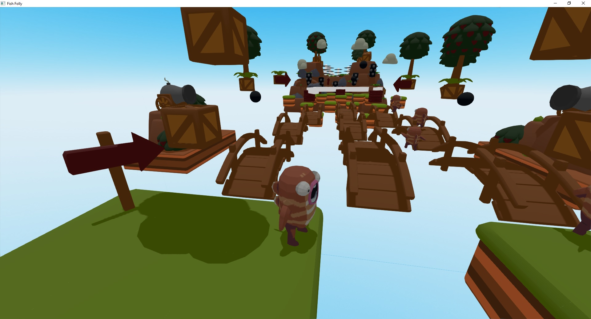
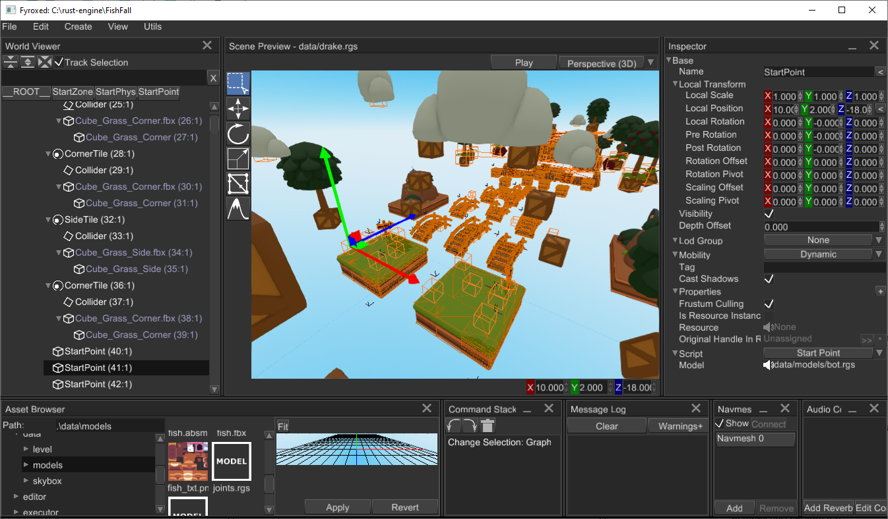

# Introduction

This section of the book contains brief overview of engine's features, it should help you to decide if the engine suits
your needs and will it be easy enough for you to use. Following chapters takes you into a tour over engine's features,
its editor, basic concepts and design philosophy.

## Introduction to Fyrox

Fyrox is a feature-rich, general purpose game engine that is suitable for any kind of games. It is capable to power games with small- or medium-sized worlds, large-sized world most likely will require some manual work. 

Games made with the engine are capable to run on desktop platforms (PC, Mac, Linux) and Web (WebAssembly). Mobile is planned for future releases.

### What can the engine do?

You can create pretty much any kind of game or interactive applications. Here's some examples of what the engine can do:





### How does the engine work?

The engine consists of two parts that you'll be actively using: the framework and the editor. The framework is a foundation of the engine, it manages rendering, sound, scripts, plugins, etc. While the editor contains lots of tools that can be used to create game worlds, manage assets, edit game objects, scripts and more.



### Programming languages

Everything of your game can be written entirely in Rust, utilizing its safety guarantees as well as speed. However, it is possible to use any scripting language you want, but that's have no built-in support, and you need to implement this manually.

### Engine Features

This is a more or less complete (yet, it can be outdated) list of engine features:

#### General

- Exceptional safety, reliability, and speed.
- PC (Windows, Linux, macOS), Android, [Web (WebAssembly) support](https://fyrox.rs/examples).
- Modern, PBR rendering pipeline.
- Comprehensive [documentation](https://docs.rs/Fyrox).
- [Guide book](https://fyrox-book.github.io)
- 2D support.
- Integrated editor.
- Fast iterative compilation.
- Classic object-oriented design.
- Lots of examples.

#### Rendering

- Custom shaders, materials, and rendering techniques.
- Physically-based rendering.
- Metallic workflow.
- High dynamic range (HDR) rendering.
- Tone mapping.
- Color grading.
- Auto-exposure.
- Gamma correction.
- Deferred shading.
- Directional light.
- Point lights + shadows.
- Spotlights + shadows.
- Screen-Space Ambient Occlusion (SSAO).
- Soft shadows.
- Volumetric light (spot, point).
- Batching.
- Instancing.
- Fast Approximate Anti-Aliasing (FXAA).
- Normal mapping.
- Parallax mapping.
- Render in texture.
- Forward rendering for transparent objects.
- Sky box.
- Deferred decals.
- Multi-camera rendering.
- Lightmapping.
- Soft particles.
- Fully customizable vertex format.
- Compressed textures support.
- High-quality mip-map on-demand generation.

#### Scene

- Multiple scenes.
- Full-featured scene graph.
- Level-of-detail (LOD) support.
- GPU Skinning.
- Various scene nodes:
    - Pivot.
    - Camera.
    - Decal.
    - Mesh.
    - Particle system.
    - Sprite.
    - Multilayer terrain.
    - Rectangle (2D Sprites)
    - Rigid body + Rigid Body 2D
    - Collider + Collider 2D
    - Joint + Joint 2D

#### Sound

- [High quality binaural sound with HRTF support](https://github.com/FyroxEngine/Fyrox/tree/master/fyrox-sound).
- Generic and spatial sound sources.
- Built-in streaming for large sounds.
- Raw samples playback support.
- WAV/OGG format support.
- HRTF support for excellent positioning and binaural effects.
- Reverb effect.

#### Serialization

- Powerful serialization system
- Almost every entity of the engine can be serialized
- No need to write your own serialization.

#### Animation

- Animation blending state machine - similar to Mecanim in Unity Engine.
- Animation retargetting - allows you to remap animation from one model to another.

#### Asset management

- Advanced asset manager.
- Fully asynchronous asset loading.
- PNG, JPG, TGA, DDS, etc. textures.
- FBX models loader.
- WAV, OGG sound formats.
- Compressed textures support (DXT1, DXT3, DTX5).

#### Artificial Intelligence (AI)

- A* pathfinder.
- Navmesh.
- Behavior trees.

#### User Interface (UI)

- [Advanced node-based UI](https://github.com/FyroxEngine/Fyrox/tree/master/fyrox-ui) with lots of widgets
- More than 32 widgets
- Powerful layout system
- Full TTF/OTF fonts support
- Based on message passing
- Fully customizable
- GAPI-agnostic
- OS-agnostic
- Button widget
- Border widget
- Canvas widget
- Color picker widget
- Color field widget
- Check box widget
- Decorator widget.
- Drop-down list widget
- Grid widget
- Image widget
- List view widget
- Popup widget
- Progress bar widget
- Scroll bar widget
- Scroll panel widget
- Scroll viewer widget
- Stack panel widget
- Tab control widget
- Text widget
- Text box widget
- Tree widget
- Window widget
- File browser widget
- File selector widget
- Docking manager widget
- NumericUpDown widget
- `Vector3<f32>` editor widget
- Menu widget
- Menu item widget
- Message box widget
- Wrap panel widget
- Curve editor widget
- User defined widget

#### Physics

- Advanced physics (thanks to the [Rapier](https://github.com/dimforge/rapier) physics engine)
- Rigid bodies.
- Rich set of various colliders.
- Joints.
- Ray cast.
- Many other useful features.
- 2D support.

## System Requirements

As any other software, Fyrox has its own system requirements that will provide the best user experience. 

- **CPU** - at least 2 core CPU with 1.5 GHz per each core. The more is better.
- **GPU** - any relatively modern GPU with OpenGL 3.3+ support. If the editor fails to start, then it is most likely your video card does not support OpenGL 3.3+. Do **not** try to run the editor on virtual machines, pretty much all of them have rudimentary support for graphics APIs which won't let you run the editor.
- **RAM** - at least 1 Gb of RAM. The more is better.
- **VRAM** - at least 256 Mb of video memory. It highly depends on your game. 

### Supported Platforms

| Platform    | Engine | Editor |
|-------------|--------|--------|
| Windows     | ✅      | ✅      |
| Linux       | ✅      | ✅      |
| macOS       | ✅¹     | ✅      |
| WebAssembly | ✅      | ❌²     |
| Android     | ✅      | ❌²     |

- ✅ - first-class support
- ❌ - not supported
- ¹ - macOS suffers from bad GPU performance on Intel chipsets, M1+ works well.
- ² - the editor works only on PC, it requires rich filesystem functionality as well as decent threading support.

## Basic concepts

Let's briefly get over some basic concepts of the engine, there's not much, but all of them are crucial to understand design decisions made in the engine.

### Classic OOP

The engine uses somewhat classic OOP with composition over inheritance - complex objects in the engine can be constructed using simpler objects.

### Scenes

In Fyrox, you break down your game in a set of reusable scenes. Pretty much anything can be a scene: a player, a weapon, a bot, level parts, etc. Scenes can be nested one into another, this helps you to break down complex scenes into reusable parts. Scene in Fyrox is also plays a role of prefab, there's pretty much no difference between them.

### Nodes and Scene Graph

A scene is made of one or more nodes (every scene must have at least one root node, to which everything else is attached). Scene node contains specific set of properties as well as _one_ optional script instance which is responsible for custom game logic. 

Typical structure of a scene node could be represented by the following example. The base object for every scene node is a `Base` node, it contains a transform, a list of children, etc. A more complex node, that _extends_ functionality of the `Base` node stores an instance of `Base` inside of them. For example, a `Mesh` node is a `Base` node _plus_ some specific info (a list of surfaces, material, etc.). The "hierarchy" depth is unlimited - a `Light` node in the engine is an enumeration of three possible types of light source. `Directional`, `Point`, and `Spot` light sources both use `BaseLight` node, which in its turn contains `Base` node inside. Graphically it can be represented like so:

```text
`Point`
|__ Point Light Properties (radius, etc.)
|__`BaseLight`
   |__ Base Light Properties (color, etc.)
   |__`Base`
      |__ Base Node Properties (transform, children nodes, etc.)
```

As you can see, this forms the nice tree (graph) that shows what the object contains. This is very natural way of describing scene nodes, it gives you the full power of building an object of any complexity.

### Plugins

Plugin is a container for "global" game data and logic, its main usage is to provide scripts with some data and to manage global game state.

### Scripts

Script - is a separate piece of data and logic, that can be attached to scene nodes. This is primary (but not single) way of adding custom game logic.

## Design Philosophy and Goals

Let's talk a bit about design philosophy and goals of the engine. Development of the engine started in the beginning
of 2019 as a hobby project to learn Rust, and it quickly showed that Rust can be a game changer in the game development
industry. Initially, the engine was just a port of [an engine](https://github.com/mrDIMAS/DmitrysEngine) that is written 
in C. At the beginning, it was very interesting to build such complex thing as game engine in such low level language without
any safety guarantees. After a year of development it became annoying to fix memory related issues (memory corruption,
leaks, etc.), luckily at that time Rust's popularity grew, and it showed on my radar. I ([@mrDIMAS](https://github.com/mrDIMAS)) 
was able to port the engine to it in less than a year. Stability has improved dramatically, no more random crashes, 
performance was at the same or better levels - time invested in learning new language was paid off. Development speed 
does not degrade over time as it was in C, it is very easy to manage growing project.

### Safety

One of the main goals in the development of the engine is to provide a high level of safety. What does this mean? 
In short: protection from memory-safety related bugs. This does not include any logic errors, but when your game is free 
of random crashes due to memory unsafety it is much easier to fix logic bugs, because you don't have to think about
potentially corrupted memory.

Safety also dictates the architectural design decisions of your game. The typical callback hell, that is possible to do in
many other languages, is very tedious to implement in Rust. It is possible, but it requires quite a lot of manual work
which quickly tells you that you're doing it wrong.

### Performance

Game engines are usually built using system-level programming languages, which provide peak performance levels. Fyrox is not
an exception. One of its design goals is to provide high levels of performance by default, leaving an opportunity for
adding custom solutions for performance-critical places.

### Ease of use

Another very important part is that the engine should be friendly to newcomers. It should lower the entry threshold, not make
it worse. Fyrox uses well known and battle-tested concepts, thus making it easier to make games with it. On the other hand,
it can still be extended with anything you need - it tries to be as good for veterans of the game industry as it is for 
newcomers.

### Battle-tested

Fyrox has large projects built on it, which helps with understanding the real needs of a general-purpose game engine. It also helps
reveal weak spots in the design and fix them.

## Frequently Asked Questions

This chapter contains answers for frequently asked questions.

### Which graphics API does the engine use?

Fyrox uses OpenGL 3.3 on PC and OpenGL ES 3.0 on WebAssembly. Why? Mainly due to historical reasons. Back in the day 
(Q4 of 2018), there weren't any good alternatives to it with a wide range of supported platforms. For example, `wgpu` 
[didn't even exist](https://crates.io/crates/wgpu/0.1.0), as its first version was released in January 2019. Other crates were taking their first baby 
steps and weren't ready for production.

#### Why not use alternatives now?

There is no need for it. The current implementation works and is more than good enough. So instead of focusing on 
replacing something that works for little to no benefit, the current focus is on adding features that are missing as 
well as improving existing features when needed.

### Is the engine based on ECS?

No, the engine uses a mixed composition-based, object-oriented design with message passing and other different approaches 
that fit the most for a particular task. Why not use ECS for everything, though? Pragmatism. Use the right tool for the job. 
Don't use a microscope to hammer nails.

### What kinds of games can I make using Fyrox?

Pretty much any kind of games, except maybe games with vast open-worlds (since there's no built-in world streaming).
In general, it depends on your game development experience.
