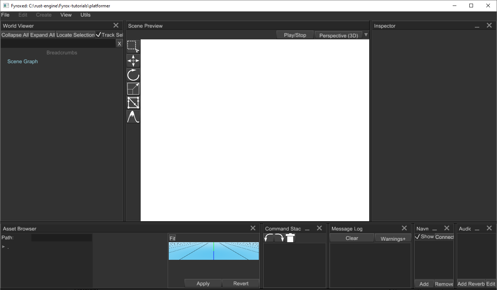
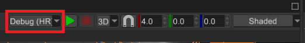
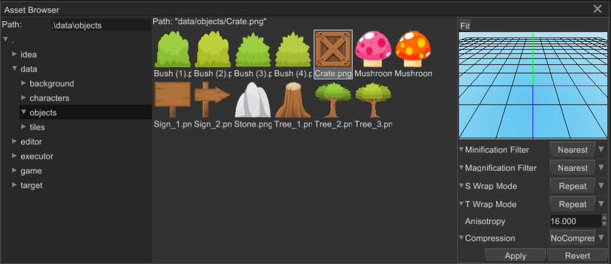

# Getting Started

This section of the book will guide you through the basics of the engine. You will learn how to create a project, use plugins, scripts, assets, and the editor. Fyrox is a modern game engine with its own scene editor, that helps you to edit game worlds, manage assets, and many more. At the end of reading this section, you'll also learn how to manage game and engine entities, how they're structured and what are the basics of data management in the engine. 

Next chapter will guide you through major setup of the engine - creating a game project using special project generator tool.

## Editor, Plugins and Scripts

Every Fyrox game is just a plugin for both the engine and the editor, such approach allows the game to run from the editor and be able to edit the game entities in it. A game can define any number of scripts, which can be assigned to scene objects to run custom game logic on them. This chapter will cover how to install the engine with its platform-specific dependencies, how to use the plugins and scripting system, how to run the editor.


### Platform-specific Dependencies

Before starting to use the engine, make sure all required platform-specific development dependencies are installed. If using Windows or macOS, no additional dependencies are required other than the latest Rust installed with appropriate toolchain for your platform.

#### Linux

On Linux, Fyrox needs the following libraries for development: `libxcb-shape0`, `libxcb-xfixes0`, `libxcb1`, `libxkbcommon`, `libasound2` and the `build-essential` package group.

For Debian based distros like Ubuntu, they can be installed like below:

```shell
sudo apt install libxcb-shape0-dev libxcb-xfixes0-dev libxcb1-dev libxkbcommon-dev libasound2-dev build-essential
```

For NixOS, you can use a `shell.nix` like below:

```nix
{ pkgs ? import <nixpkgs> { } }:
pkgs.mkShell rec {
  nativeBuildInputs = with pkgs.buildPackages; [
    pkg-config
    xorg.libxcb
    alsa-lib
    wayland
    libxkbcommon
    libGL
  ];

  shellHook = with pkgs.lib; ''
    export LD_LIBRARY_PATH=${makeLibraryPath nativeBuildInputs}:/run/opengl-driver/lib:$LD_LIBRARY_PATH
  '';
}
```

### Quick Start

Run the following commands to start using the editor as quickly as possible.

```sh
cargo install fyrox-template
fyrox-template init --name fyrox_test --style 2d
cd fyrox_test
cargo run --package editor --release
```

### Project Generator

Fyrox plugins are written in Rust, this means that if the source code of the game changes one must recompile. This architecture requires some boilerplate code. Fyrox offers a special tiny command line tool - `fyrox-template`. It helps generate all this boilerplate with a single command. Install it by running the following command:

```shell
cargo install fyrox-template
```

_Note for Linux:_ This installs it in `$user/.cargo/bin`. If receiving errors about the `fyrox-template` command not being found, add this hidden cargo bin folder to the operating systems `$PATH` environment variable.

Now, navigate to the desired project folder and run the following command:

```shell
fyrox-template init --name my_game --style 3d
```

Note that unlike `cargo init`, this will create a new folder with the given name.

The tool accepts two arguments - a project name (`--name`) and a style (`--style`), which defines the contents of the default scene. After initializing the project, go to `game/src/lib.rs` - this is where the game logic is located, as you can see, the `fyrox-template` generated quite a bit of code for you. There are comments explaining what each place is for. For more info about each method, please refer [to the docs](https://docs.rs/fyrox/latest/fyrox/plugin/trait.Plugin.html).

Once the project is generated, memorize the two commands that will help run your game in different modes:

- `cargo run --package editor --release` - launches the editor with your game attached. The editor allows you to run your game from it and edit its game entities. It is intended to be used only for development.
- `cargo run --package executor --release` - creates and runs the production binary of your game, which can be shipped (for example - to a store).

Navigate to your project's directory and run `cargo run --package editor --release`, after some time you should see the editor:



In the editor you can start building your game scene. **Important note:** your scene must have at least one camera, otherwise you won't see a thing. Read the next chapter to learn how to use the editor.

### Using the Latest Engine Version

Due to the nature of the software development, some bugs will inevitably sneak into the major releases, due to this, you may want to use the latest engine version from the repository on GitHub, since it is the most likely to have bugs fixed (you can also contribute by fixing any bugs you find or at least, by [filing an issue](https://github.com/FyroxEngine/Fyrox/issues)).

#### Automatic

> ⚠️ `fyrox-template` has special sub-command - `upgrade` to quickly upgrade to desired engine version. To upgrade to 
> the latest version (`nightly`) you should execute `fyrox-template upgrade --version nightly` command in your game's 
> directory.

There are three main variants for `--version` switch:

- `nightly` - uses latest nightly version of the engine from GitHub directly. This is the preferable version if you want to use the latest changes and bug fixes as they release.
- `latest` - uses latest stable version of the engine. This option also supports `--local` key, that sets the path to the engine to `../Fyrox/fyrox` and the editor to `../Fyrox/editor`. Obviously, such path requires the engine to be located in the parent directory of your project. This option could be useful if you want to use custom version of the engine (for example, if you're developing a patch for the engine).
- `major.minor.patch` - uses specific stable version from crates.io (`0.30.0` for example).

#### Manual

Engine version can also be updated manually. The first step to take is to install the latest `fyrox-template`, this can be done with a single `cargo` command:

```shell
cargo install fyrox-template --force --git https://github.com/FyroxEngine/Fyrox
```

This will ensure you're using the latest project/script template generator, which is important, since old versions of the template generator will most likely generate outdated code, no longer be compatible with the engine.

To switch existing projects to the latest version of the engine, you need to specify paths pointing to the remote repository for the `fyrox` and `fyroxed_base` dependencies. You need to do this in the `game`, `executor`, and `editor` projects. First, open `game/Cargo.toml` and change the `fyrox` dependency to the following:

```toml
[dependencies]
fyrox = { git = "https://github.com/FyroxEngine/Fyrox" }
```

Do the same for `executor/Cargo.toml`. The `editor` has two dependencies we need to change: `fyrox` and `fyroxed_base`. Open the `editor/Cargo.toml` and set both dependencies to the following:

```toml
[dependencies]
fyrox = { git = "https://github.com/FyroxEngine/Fyrox" }
fyroxed_base = { git = "https://github.com/FyroxEngine/Fyrox" }
```

Now your game will use the latest engine and editor, but beware - new commits could bring some API breaks. You can avoid these by specifying a particular commit, just add `rev = "desired_commit_hash"` to every dependency like so:

```toml
[dependencies]
fyrox = { git = "https://github.com/FyroxEngine/Fyrox", rev = "0195666b30562c1961a9808be38b5e5715da43af" }
fyroxed_base = { git = "https://github.com/FyroxEngine/Fyrox", rev = "0195666b30562c1961a9808be38b5e5715da43af" }
```

To bring a local git repository of the engine to being up-to-date, just call `cargo update` at the root of the project's workspace. This will pull the latest changes from the remote, unless there is no `rev` specified.

Learn more about dependency paths on the official `cargo` documentation, [here](https://doc.rust-lang.org/cargo/reference/specifying-dependencies.html#specifying-dependencies-from-git-repositories).

### Adding Game Logic

Any object-specific game logic should be added using scripts. A script is a "container" for data and code, that will be executed by the engine. Read the [Scripts](../scripting/script.md) chapter to learn how to create, edit, and use scripts in your game.

## Code Hot Reloading

Fyrox supports code hot reloading (CHR for short), which allows you to recompile the game code while the game is running. This functionality significantly reduces iteration times and allows rapid prototyping. This way, Rust becomes a sort of "scripting" language, but with all Rust safety and performance guarantees. CHR in action looks like this:

<iframe width="560" height="315" src="https://www.youtube.com/embed/vq6P3Npydmw" title="YouTube video player" frameborder="0" allow="accelerometer; autoplay; clipboard-write; encrypted-media; gyroscope; picture-in-picture" allowfullscreen></iframe>

### How To Use

> ⚠️ If you have an existing project from one of the previous versions of the engine, the best way to add support for
> CHR is to re-generate the entire project and copy all the assets and game code in the new project. CHR requires very
> specific project structure and a small mistake in it could lead to incorrect behavior.

CHR is quite simple to use - a project generated by `fyrox-template` already has all that is needed for hot reloading. Yet, it requires some bootstrapping to start using it. At first, you need to compile your game plugin using the following command:

```shell
RUSTFLAGS="-C prefer-dynamic=yes" cargo build --package game_dylib --no-default-features --features="dylib-engine" --profile dev-hot-reload
```

This command will compile the engine DLL (`fyrox_dylib.dll/so`) and the plugin DLL (`game_dylib.dll/so`). Please note the mandatory environment variable `RUSTFLAGS="-C prefer-dynamic=yes"`. It forces the compiler to link standard library dynamically. It is very important, because if not set, the standard library will be duplicated in game plugin and engine, which will lead to subtle bugs.

> ⚠️ Environment variables can be set in a different ways, depending on your OS. On Linux it simply prepends the actual
> command, on Windows it requires a [separate command](https://learn.microsoft.com/en-us/windows-server/administration/windows-commands/set_1#examples). 
> Other OSes can have their own ways of setting environment variables.

The next step is to compile the editor in CHR mode. To do that, run the following command:

```shell
RUSTFLAGS="-C prefer-dynamic=yes" cargo run --package editor --no-default-features --features="dylib" --profile dev-hot-reload
```

This command will compile the editor in CHR mode and run it. After this, all you need to do is to select build profile in the editor to be `Debug (HR)`:



Once that's done you can run your game by clicking on the green `Play` button. You can switch between CHR and normal mode (static linking) at any time. Keep in mind, that if you run the editor in CHR mode, it will also reload all changed plugins.

### Build Profiles

CHR uses separate build profiles: `dev-hot-reload` (no optimizations) and `release-hot-reload` (with optimizations). Separate build profiles allows you to quickly switch between statically linked plugins and code hot reloading. This could be useful if you're experiencing some issues with hot reloading (see next section for more info).

### Stability

CHR is very new and experimental feature of the engine, it is based on wildly unsafe functionality which could result in memory corruption, subtle bugs, etc. If you experience weird behaviour of your game after hot reloading, run the game in normal (static linking) mode instead. Please report any bugs in the [issue tracker](https://github.com/FyroxEngine/Fyrox/issues) of the engine. CHR was tested on two relatively large games - [Fish Folly](https://github.com/mrDIMAS/FishFolly) and [Station Iapetus](https://github.com/mrDIMAS/StationIapetus). You can download these projects and try CHR yourself.

### Technical Details and Limitations

CHR is using standard operating system (OS) mechanism of shared libraries (DLL for short). Pretty much any OS can load native code into a running process dynamically from a DLL. Any dynamically loaded library can then be unloaded from the process memory. This gives a perfect opportunity to reload game code in runtime. It may sound quite easy, but on practice there are a lot of issues.

#### Plugin Entities and Reloading

Plugins can supply the engine with a predefined set of entities (such as scripts, etc.). These entities are serialized into a memory blob before the plugin itself is unloaded. When all plugins are reloaded, this memory blob is used to restore the state of plugin entities. That being said, pretty much all plugin entities must be serializable (implement `Visit` trait).

#### Trait Objects

Trait object are very problematic with hot reloading, because internally trait objects contains vtable with function pointers. These pointers can be easily invalidated if the plugin is unloaded. This applies even to engine trait objects, if they're created directly from the plugin side. The only way to bypass this issue is to use special methods from the engine to create its trait objects. It is possible to add a lint to clippy to check for such cases (see the respective [issue](https://github.com/rust-lang/rust-clippy/issues/12819)).

#### Dangling Objects

Current plugin system tries its best to remove all plugin's entities from the engine internals before reloading plugins. However, some objects could be overlooked by this system, which could result in crash or memory corruption. Current approach of preventing to having dangling objects is based on built-in reflection system - the plugin system iterates across all fields of every object and checks its assembly name. If the assembly name match the plugin's assembly name, then this object must be deleted before the plugin is unloaded. 

#### Non-serializable Entities

Not every object can be serialized, and in this case the current plugin system calls a special method to restore such non-serializable entities after hot reloading. Such entities could include server connections, job queues, etc.

## FyroxEd Overview

FyroxEd - is the native editor of Fyrox, it is made with one purpose - to be an integrated game development environment that helps you build your game from start to finish with relatively low effort.

You'll be spending a lot of time in the editor, so you should get familiar with it and learn how to use its basic functionalities. This chapter will guide you through the basics, advanced topics will be covered in their respective chapters.

### Windows

When you open the editor for the first time you may be confused by the amount of windows, buttons, lists, etc. you'll be presented with. Each window serves a different purpose, but all of them work together to help you make your game. Let's take a look at a screenshot of the editor and learn what each part of it is responsible for (please note that this can change over time, because development is quite fast and images can easily become outdated):


- **World viewer** - shows every object in the scene and their relationships. Allows inspecting and editing the contents of the scene in a hierarchical form.
- **Scene preview** - renders the scene with debug info and various editor-specific objects (gizmos, entity icons, etc.). Allows you to select, move, rotate, scale, delete, etc. various entities. The **Toolbar** on its left side shows available context-dependent tools.
- **Inspector** - allows you to modify various properties of the selected object.
- **Message Log** - displays important messages from the editor.
- **Navmesh Panel** - allows you to create, delete, and edit navigational meshes.
- **Command Stack** - displays your most recent actions and allows you to undo or redo their changes.
- **Asset Browser** - allows you to inspect the assets of your game and to instantiate resources in the scene, among other things.
- **Audio Context** - allows you to edit the settings of the scene's sound context (global volume, available audio buses, effects, etc.)

### Creating or loading a Scene

FyroxEd works with scenes - a scene is a container for game entities, you can create and edit one scene at a time. You must have a scene loaded to begin working with the editor. To create a scene go to `File -> New Scene`.

To load an existing scene, go to `File -> Load` and select the desired scene through the file browser. Recently opened scenes can be loaded more quickly by going to `File -> Recent Scenes` and selecting the desired one.

### Populating a Scene

A scene can contain various game entities. There are two equivalent ways of creating these:

- By going to `Create` in the main menu and selecting the desired entity from the drop down.
- By right-clicking on a game entity in the `World Viewer` and selecting the desired entity from the `Create Child` sub-menu.

Complex objects usually made in 3D modelling software (Blender, 3Ds Max, Maya, etc.) can be saved in various formats. Fyrox supports FBX format, which is supported by pretty much any 3D modelling software. You can instantiate such objects by simply dragging the one you want and dropping it on the `Scene Preview`. While dragging it, you'll also see a preview of the object.

You can do the same with other scenes made in the editor (`rgs` files), for example, you can create a scene with a few objects in it with some scripts and re-use them within other scenes. Such scenes are called [prefabs](../scene/prefab.md).

### Saving a Scene

To save your work, go to `File -> Save`. If you're saving a new scene, the editor will ask you to specify a file name and a path to where the scene will be saved. Scenes loaded from a file will automatically be saved to the path they were loaded from.

### Undoing and redoing

FyroxEd remembers your actions and allows you to undo and redo the changes done by these. You can undo or redo changes by either going to `Edit -> Undo/Redo` or through the usual shortcuts: `Ctrl+Z` - to undo, `Ctrl+Y` - to redo.

### Controls

There are number of control keys that you'll be using most of the time, pretty much all of them work in the `Scene Preview` window:

#### Editor camera movement
Click and hold `[Right Mouse Button]` within the `Scene Preview` window to enable the movement controls:
  - `[W][S][A][D]` - Move camera forward/backward/left/right
  - `[Space][Q]/[E]` - Raise/Lower Camera
  - `[Ctrl]` - Speed up
  - `[Shift]`- Slowdown
#### Others
- `[Left Mouse Button]` - Select
- `[Middle Mouse Button]` - Pan camera in viewing plane
- `[1]` - Select interaction mode
- `[2]` - Move interaction mode
- `[3]` - Scale interaction mode
- `[4]` - Rotate interaction mode
- `[5]` - Navigational mesh editing mode
- `[6]` - Terrain editing interaction mode
- `[Ctrl]+[Z]` - Undo
- `[Ctrl]+[Y]` - Redo
- `[Delete]` - Delete current selection.

### Play Mode

One of the key features of the editor is that it allows you to run your game from it in a separate process. Use the `Play/Stop` button at the top of the `Scene Preview` window to enter or leave Play Mode. Keep in mind, that the editor UI will be locked while you're in Play Mode. 

Play Mode can be activated only for projects made with the `fyrox-template` (or for projects with a similar structure). The editor calls `cargo` commands to build and run your game in a separate process. Running the game in a separate process ensures that the editor won't crash if your game does, it also provides excellent isolation between the game and the editor, not giving a chance to break the editor by running the game.

### Additional Utilities

There are also number of powerful utilities that will make your life easier, they can be found under the `Utils` section of the main menu:

- Curve Editor - allows you to create and edit curve resources to make complex laws for game parameters.
- Path Fixer - helps you fix incorrect resource references in your scenes.

## Scene and Scene Graph

When you're playing a game, you often see various objects scattered around the screen, all of them are forming a _scene_. A scene is just a set of a variety objects, as in many other game engines, Fyrox allows you to create multiple scenes for multiple purposes, for example, one scene could be used for a menu, a bunch of others for game levels, and another one for an ending screen. Scenes can also be used to create a source of data for other scenes, such scenes are called _prefabs_. Scenes can also be rendered in a texture, which can be used in other scenes - this way you can create interactive screens that show other places.

While playing games, you may have noticed that some objects behaves as if they were linked to other objects, for example, a character in a role-playing game could carry a sword. While the character holds the sword, it is linked to his arm. Such relations between the objects can be presented by a graph structure.

Simply speaking, a graph is a set of objects with hierarchical relationships between each object. Each object in the graph is called a _node_. In the example with the sword and the character, the sword is a _child_ node of the character, and the character is a _parent_ node of the sword (here we ignore the fact that in reality, character models usually contain complex skeletons, with the sword actually being attached to one of the hands' bones, not to the character).

You can change the hierarchy of nodes in the editor using a simple drag'n'drop functionality in the `World Viewer` - drag a node onto some other node, and it will attach itself to it.

### Building Blocks or Scene Nodes

The engine offers various types of "building blocks" for your scene, each such block is called a _scene node_.

- [Base](../scene/base_node.md) - stores hierarchical information (a handle to the parent node and handles to children nodes), local and global transform, name, tag, lifetime, etc. It has self-describing name - it's used as a base node for every other scene node via composition.
- [Mesh](../scene/mesh_node.md) - represents a 3D model. This one of the most commonly used nodes in almost every game. Meshes can be easily created either programmatically, or be made in some 3D modelling software, such as Blender, and then loaded into the scene.
- [Light](../scene/light_node.md) - represents a light source. There are three types of light sources:
    - **Point** - emits light in every direction. A real-world example would be a light bulb.
    - **Spot** - emits light in a particular direction, with a cone-like shape. A real-world example would be a flashlight.
    - **Directional** - emits light in a particular direction, but does not have position. The closest real-world example would be the Sun.
- [Camera](../scene/camera_node.md) - allows you to see the world. You must have at least one camera in your scene to be able to see anything.
- [Sprite](../scene/sprite_node.md) - represents a quad that always faces towards a camera. It can have a texture and size and can also can be rotated around the "look" axis.
- [Particle system](../scene/particle_system_node.md) - allows you to create visual effects using a huge set of small particles. It can be used to create smoke, sparks, blood splatters, etc.
- [Terrain](../scene/terrain_node.md) - allows you to create complex landscapes with minimal effort.
- [Decal](../scene/decal_node.md) - paints on other nodes using a texture. It is used to simulate cracks in concrete walls, damaged parts of the road, blood splatters, bullet holes, etc.
- [Rigid Body](../physics/rigid_body.md) - a physical entity that is responsible for the dynamic of the rigid. There is a special variant for 2D - `RigidBody2D`.
- [Collider](../physics/collider.md) - a physical shape for a rigid body. It is responsible for contact manifold generation, without it, any rigid body will not participate in simulation correctly, so every rigid body must have at least one collider. There is a special variant for 2D - `Collider2D`.
- [Joint](../physics/joint.md) - a physical entity that restricts motion between two rigid bodies. It has various amounts of degrees of freedom depending on the type of the joint. There is a special variant for 2D - `Joint2D`.
- [Rectangle](../scene/rectangle.md) - a simple rectangle mesh that can have a texture and a color. It is a very simple version of a Mesh node, yet it uses very optimized renderer, that allows you to render dozens of rectangles simultaneously. This node is intended for use in **2D games** only.
- [Sound](../sound/sound.md) - a sound source universal for 2D and 3D. Spatial blend factor allows you to select a proportion between 2D and 3D.
- Listener - an audio receiver that captures the sound at a particular point in your scene and sends it to an audio context for processing and outputting to an audio playback device.
- Animation Player - a container for multiple animations. It can play animations made in the [animation editor](../animation/anim_editor.md) and apply animation poses to respective scene nodes.
- Animation Blending State Machine - a state machine that mixes multiple animations from multiple states into one; each state is backed by one or more animation playing or blending nodes. See its [respective chapter](../animation/absm_editor.md) for more info.

Every node can be created either in the editor (through `Create` on the main menu, or through `Add Child` after right-clicking on a game entity) or programmatically via their respective node builder (see [API docs](https://docs.rs/fyrox/latest/fyrox/scene/index.html) for more info). These scene nodes allow you to build almost any kind of game. It is also possible to create your own types of nodes, but that is an advanced topic, which is covered in a [future chapter](../scene/custom_node.md).

### Local and Global Coordinates

A graph describes your scene in a very natural way, allowing you think in terms of relative and absolute coordinates when working with _scene nodes_.

A scene node has two kinds of transform - a local and global. The local transform defines where the node is located relative to its origin, its scale as a percentage, and its rotation around any arbitrary axis.The global transform is almost the same, but it also includes the whole chain of transforms of the parent nodes. Going back to the example of the character and the sword, if the character moves, and by extension the sword, the global transform of the sword will reflect the changes made to the character position, yet its local transform will not, since that represents the sword's position's relative to the character's, which didn't change.

This mechanism is very simple, yet powerful. The full grace of it unfolds when you're working with 3D models with skeletons. Each bone in a skeleton has its parent and a set of children, which allows you to rotate, translate, or scale them to animate your entire character.

## Assets

Pretty much every game depends on various assets, such as 3D models, textures, sounds, etc. Fyrox has its own assets pipeline made to make your life easier.

### Asset Types

The engine offers a set of assets that should cover all of your needs:

- [Models](../resources/model.md) - are a set of objects. They can be a simple 3D model (barrels, bushes, weapons, 
etc.) or complex scenes with lots of objects and possibly other model instances. Fyrox supports two main formats:
FBX - which can be used to import 3D models, RGS - which are scenes made in FyroxEd. RGS models are special, as they can be 
used as _hierarchical prefabs_.
- [Textures](../resources/texture.md) - are images used to add graphical details to objects. The
engine supports multiple texture formats, such as PNG, JPG, BMP, etc. Compressed textures in DDS format are also supported.
- [Sound buffers](../resources/sound.md) - are data buffers for sound sources. Fyrox supports WAV and OGG formats. 
- [Curves](../resources/curve.md) - are parametric curves. They're used to create complex functions for numeric parameters. 
They can be made in the `Curve Editor` (`Utils -> Curve Editor`)
- [HRIR Spheres](../sound/hrtf.md) - head-related impulse response collection used for head-related transfer function
in the HRTF sound rendering.
- [Fonts](../ui/font.md) - arbitrary TTF/OTF fonts.
- [Materials](../rendering/materials.md) - materials for rendering.
- [Shaders](../rendering/shaders.md) - shaders for rendering.
- It is also possible to create custom assets. See [respective chapter](../resources/custom.md) for more info.

### Asset Management

Asset management is performed from the `Asset Browser` window in the editor, you can select an asset, preview it, and edit its import options. Here's a screenshot of the asset browser with a texture selected:



The most interesting part here is the import options section under the previewer. It allows you to set asset-specific import options and apply them. Every asset has its own set of import options. See their respective asset page from the section above to learn what each import option is for.

### Asset Instantiation

Some asset types can be instantiated in scenes; for now, you can only create direct instances from models. This is done by simply dragging the model you want to instantiate and dropping it on the `Scene Preview`. While dragging it, you'll also see a preview of the model.


The maximum amount of asset instances is not limited by the engine but it is by the memory and CPU resources of your PC. Note that the engine does try to reuse data across instances as much as possible.

You can also instantiate assets dynamically from your code. Here's an example of that for a Model:

```rust,no_run,edition2018
{{#include ../code/snippets/src/resource/mod.rs:instantiate_model}}
```

This is very useful with prefabs that you may want to instantiate in a scene at runtime. 

### Loading Assets

Usually, there is no need to manually handle the loading of assets since you have the editor to help with that - just create a scene with all the required assets. However, there are times when you may need to instantiate some asset dynamically, for example, a bot prefab. For these cases, you can use the `ResourceManager::request<T>` method with the appropriate type, such as `Model`, `Texture`, `SoundBuffer`, etc.

## Data Management

The engine uses pools to store most objects (scene nodes in a graph, animations in an animation player, sound sources in an audio context, etc.). Since you'll use them quite often, reading and understanding this chapter is recommended. 

### Motivation

Rust ownership system and borrow checker, in particular, dictate the rules of data management. In game development, you often have the need to reference objects from other objects. In languages like C, this is usually achieved by simply storing a raw pointer and calling it a day. That works, yet it's remarkably unsafe - you risk either forgetting to destroy an object and leaking memory or destroying an object still being referenced and then trying to access deallocated memory. Other languages, like C++, allow you to store _shared pointers_ to your data, which by keeping a reference count, ensures the previous doesn't happen at the cost of a, most often, negligible overhead. Rust counts with smart pointers similar to this, though not without their limitations. There is the `Rc/Arc` - they function like _shared pointers_, except they don't allow mutating their content, only reading it. If you want mutability, you use either a `RefCell` for a single-threaded environment, or a `Mutex` for a multithreaded environment. That is where the problems begin. For types such as `Rc<RefCell>` or `Arc<Mutex>`, Rust enforces its borrowing rules at runtime, which are unlimited readers but a single writer. Any attempt to borrow mutably more than once at a time will lead to a runtime error.

Another problem with these shared references is that is very easy to accidentally create cyclical references that prevent objects from ever being destroyed. While the previous could be lived with, the last problem is especially severe in the case of games: the overhead of runtime checks. In the case of a `Rc<RefCell>`, it is a single reference counter for given accesses to the data, but in the case of a `Arc<Mutex>`, it is a mutex lock. 

The solution to these problems is far from ideal; it certainly has its own downfalls. Instead of scattering objects across memory and then having to manage the lifetime of each of them through reference counting, we can store all of the objects in a single and contiguous memory block and then use indices to access each object. Such a structure is called a pool. 

### Technical Details

A pool is an efficient method of data management. A pool is a vector with entries that can be either vacant or occupied. Each entry, regardless of its status, also stores a number called a _generation_ number. This is used to understand whether an entry has changed over time or not. When an entry is reused, its generation number is increased, rendering all previously created handles leading to the entry invalid. This is a simple and efficient algorithm for tracking the lifetime of objects.

To access the data in the entries, the engine uses the previously mentioned _handles_. A handle is a pair of the index of an entry
and a generation number. When you put an object in the pool, this gives you the handle that leads to the object, as well as the 
entry's current generation number. The number remains valid until you "free" the object, which makes the entry vacant again.

### Advantages

- Since a pool is a contiguous memory block, it is far more CPU cache-friendly. This reduces the occurrences of CPU cache misses, which makes accesses to data blazingly fast.
- Almost every entity in Fyrox lives on its own pool, which makes it easy to create data structures
like graphs, where nodes refer to other nodes. In this case, nodes simply need to store a handle to refer to other nodes.
- Simple lifetime management. There is no way to leak memory since cross-references can only be done via handles.
- Fast random access with a constant complexity.
- Handles are the same size as a pointer on a 64-bit architecture, just 8 bytes.

### Disadvantages

- Pools can contain lots of gaps between currently used memory, which may lead to less efficient memory usage. 
- Handles are sort of weak references, but worse. Since they do not own any data nor even point to their data, you need a reference to its pool instance in order to borrow the data a handle leads to.
- Handles introduce a level of indirection that can hurt performance in places with high loads that require random access, though this is not too significant as random access is already somewhat slow because of potential CPU cache misses.

### Usage

You'll use `Handle` _a lot_ while working with Fyrox. So where are the main usages of pools and handles? The largest is in a [scene graph](../scene/graph.md). This stores all the nodes in a pool and gives handles to each node. Each scene node stores a handle to their parent node and a set of handles to their children nodes. A scene graph automatically ensures that such handles are valid. In [scripts](../scripting/script.md), you can also store handles to scene nodes and assign them in the editor. [Animation](../animation/animation.md) is another place that stores handles to animated scene nodes. [Animation Blending State Machine](../animation/blending.md) stores its own state graph using a pool; it also takes handles to animations from an animation player in a scene. 

And the list could keep going for a long time. This is why you need to understand the basic concepts of data management, as to efficiently and fearlessly use Fyrox.

### Borrowing

Once an object is placed in a pool, you have to use its respective handle to get a reference to it. This can be done with either `pool.borrow(handle)` or `pool.borrow_mute(handle)`, or by using the `Index` trait: `pool[handle]`. Note that these methods panic when the handle given is invalid. If you want to be safe, use the `try_borrow(handle)` or `try_borrow_mut(handle)` method.

```rust,no_run
# extern crate fyrox;
# use fyrox::core::pool::Pool;
#
# fn main() {
let mut pool = Pool::<u32>::new();
let handle = pool.spawn(1);

let obj = pool.borrow_mut(handle);
*obj = 11;

let obj = pool.borrow(handle);
assert_eq!(*obj, 11);
# }
```

### Freeing 

You can extract an object from a pool by calling `pool.free(handle)`. This will give you the object back and make all current handles to it invalid.

```rust,no_run
# extern crate fyrox;
# use fyrox::core::pool::Pool;
#
# fn main() {
let mut pool = Pool::<u32>::new();
let handle = pool.spawn(1);

pool.free(handle);

let obj = pool.try_borrow(handle);
assert_eq!(obj, None);
# }
```

### Take and Reserve

Sometimes you may want to temporarily extract an object from a pool, do something with it, and then put it back, yet not want to break every handle to the object in the process. There are three methods for this:

1) `take_reserve` + `try_take_reserve` - moves an object out of the pool but leaves the entry in an occupied state. This function returns a tuple with two values `(Ticket<T>, T)`. The latter one being your object, and the former one being a wrapper over its index that allows you to return the object once you're done with it. This is called a ticket. Note that attempting to borrow a moved object will cause a panic! 
2) `put_back` - moves the object back using the given ticket. The ticket contains information about where in the pool to return the object to. 
3) `forget_ticket` - makes the pool entry vacant again. Useful in cases where you move an object out of the pool, and then decide you won't return it. If this is the case, you **must** call this method, otherwise, the corresponding entry will remain unusable.

Reservation example:

```rust,no_run
# extern crate fyrox;
# use fyrox::core::pool::Pool;
#
# fn main() {
let mut pool = Pool::<u32>::new();
let handle = pool.spawn(1);

let (ticket, ref mut obj) = pool.take_reserve(handle);

*obj = 123;

// Attempting to fetch while there is an existing reservation, will fail.

let attempt_obj = pool.try_borrow(handle);
assert_eq!(attempt_obj, None);

// Put the object back, allowing borrowing again.

pool.put_back(ticket, *obj);

let obj = pool.borrow(handle);

assert_eq!(obj, &123);
# }
```

Forget example:

```rust,no_run
# extern crate fyrox;
# use fyrox::core::pool::Pool;
#
# fn main() {
let mut pool = Pool::<u32>::new();
let handle = pool.spawn(1);

let (ticket, _obj) = pool.take_reserve(handle);

pool.forget_ticket(ticket);

let obj = pool.try_borrow(handle);

assert_eq!(obj, None);
# }
```

### Iterators

There are a few possible iterators, each one serving its own purpose:

1) `iter/iter_mut` - creates an iterator over occupied pool entries, returning references to each object.
2) `pair_iter/pair_iter_mut` - creates an iterator over occupied pool entries, returning tuples of a handle and reference to each object. 

```rust,no_run
# extern crate fyrox;
# use fyrox::core::pool::Pool;
#
# fn main() {
let mut pool = Pool::<u32>::new();
let _handle = pool.spawn(1);

let mut iter = pool.iter_mut();

let next_obj = iter.next().unwrap();

assert_eq!(next_obj, &1);

let next_obj = iter.next();

assert_eq!(next_obj, None);
# }
```

### Direct Access

You have the ability to get an object from a pool using only an index. The methods for that are `at` and `at_mut`.

### Validation
 
To check if a handle is valid, you can use the `is_valid_handle` method.

### Type-erased Handles

The pool module also offers type-erased handles that can be of use in some situations. Still, try to avoid using these, as they may introduce hard-to-reproduce bugs. Type safety is always good :3

A type-erased handle is called an `ErasedHandle` and can be created either manually or from a strongly-typed handle. Both handle types are interchangeable; you can use the `From` and `Into` traits to convert from one to the other.

#### Getting a Handle to an Object by its Reference

If you need to get a handle to an object from only having a reference to it, you can use the `handle_of` method.

#### Iterate Over and Filter Out Objects

The `retain` method allows you to filter your pool's content using a closure provided by you.

## Borrow Checker

Rust has a [famous borrow checker](https://doc.rust-lang.org/book/ch04-01-what-is-ownership.html), that became a sort of horror story for newcomers. It usually treated like an enemy, that prevents your from writing anything useful as you may get used in other languages. In fact, it is a very useful part of Rust that proves correctness of your program and does not let you doing nasty things like memory corruption, data races, etc. This chapter explains how Fyrox solves the most common borrowing issues and makes game development as easy as in any other game engine.

### Multiple Borrowing

When writing a script logic there is often a need to do a multiple borrowing of some data, usually it is other scene nodes. In normal circumstances you can borrow each node one-by-one, but in other cases you can't do an action without borrowing two or more nodes simultaneously. In this case you can use multi-borrowing:

```rust
{{#include ../code/snippets/src/borrowck/mod.rs:synthetic_example}}
```

As you can see, you can borrow multiple nodes at once with no compilation errors. Borrowing rules in this case are enforced at runtime. They're the same as standard Rust borrowing rules:

1) You can have infinite number of immutable references to the same object.
2) You can have only one mutable reference to the same object.

Multi-borrow context provides detailed error messages for cases when borrowing has failed. For example, it will tell you if you're trying to mutably borrow an object, that was already borrowed as immutable (and vice versa).
It also provides handle validation and will tell you what's wrong with it. It could be either invalid index of it, or the generation. The latter means that the object at the handle was changed and the handle is invalid.

The previous example looks kinda synthetic and does not show the real-world code that could lead to borrowing issues. Let's fix this. Imagine that you're making a shooter, and you have bots, that can follow and attack targets. Then the code could look like this: 

```rust
{{#include ../code/snippets/src/borrowck/mod.rs:bot_example}}
```

As you can see, for this code to compile we need to borrow at least two nodes simultaneously: the node with `Bot` script and the `target` node. This is because we're calculating distance between the two nodes to switch animations accordingly (attack if the target is close enough). As pretty much any approach, this one is not ideal and comes with its own pros and cons. The pros are quite simple:

- No compilation errors - sometimes Rust is too strict about borrowing rules, and valid code does not pass its checks.
- Better ergonomics - no need to juggle with temporary variable here and there to perform an action.

The cons are:

- Multi-borrowing is slightly slower (~1-4% depending on your use case) - this happens because the multi-borrowing context checks borrowing rules at runtime.


### Message Passing

Sometimes the code becomes so convoluted, so it is simply hard to maintain and understand what it is doing. This happens when code coupling get to a certain point, which requires very broad context for the code to be executed. For example, if bots in your game have weapons it is so tempting to just borrow the weapon and call something like `weapon.shoot(..)`. When your weapon is simple then it might work fine, however when your game gets bigger and weapons get new features simple `weapon.shoot(..)` could be not enough. It could be because `shoot` method get more and more arguments or by some other reason. This is quite common case and in general when your code become tightly coupled it becomes hard to maintain it and what's more important - it could easily result in compilation errors, that comes from borrow checker. To illustrate this, let's look at this code:

```rust
{{#include ../code/snippets/src/borrowck/without_message_passing.rs:without_message_passing}}
```

This is probably one of the typical implementations of shooting in games - you cast a ray from the weapon and if it hits a bot, you're applying some damage to it. In this case bots can also shoot, and this is where borrow checker again gets in our way. If you try to uncomment the `// weapon.shoot(ctx.handle, &mut ctx.scene.graph);` line you'll get a compilation error, that tells you that `ctx.scene.graph` is already borrowed. It seems that we've stuck, and we need to somehow fix this issue. We can't use multi-borrowing in this case, because it still enforces borrowing rules and instead of compilation error, you'll runtime error.

To solve this, you can use well-known message passing mechanism. The core idea of it is to not call methods immediately, but to collect all the needed data for the call and send it an object, so it can do the call later. Here's how it will look:

```rust
{{#include ../code/snippets/src/borrowck/message_passing.rs:message_passing}}
```

The weapon now subscribes to `ShootMessage` and listens to it in `on_message` method and from there it can perform the actual shooting without any borrowing issues. The bot now just sends the `ShootMessage` instead of borrowing the weapon trying to call `shoot` directly. The messages do not add any one-frame delay as you might think, they're processed in the same frame so there's no one-or-more frames desynchronization.

This approach with messages has its own pros and cons. The pros are quite significant: 

- Decoupling - coupling is now very loose and done mostly on message side.
- Easy to refactor - since the coupling is loose, you can refactor the internals with low chance of breaking existing code, that could otherwise be done because of intertwined and convoluted code.
- No borrowing issues - the method calls are done in different places and there's no lifetime collisions.
- Easy to write unit and integration tests - this comes from loose coupling. 

The cons are the following: 

- Message passing is slightly slower than direct method calls (~1-7% depending on your use case) - you should keep message granularity at a reasonable level. Do not use message passing for tiny changes, it will most likely make your game slower.
