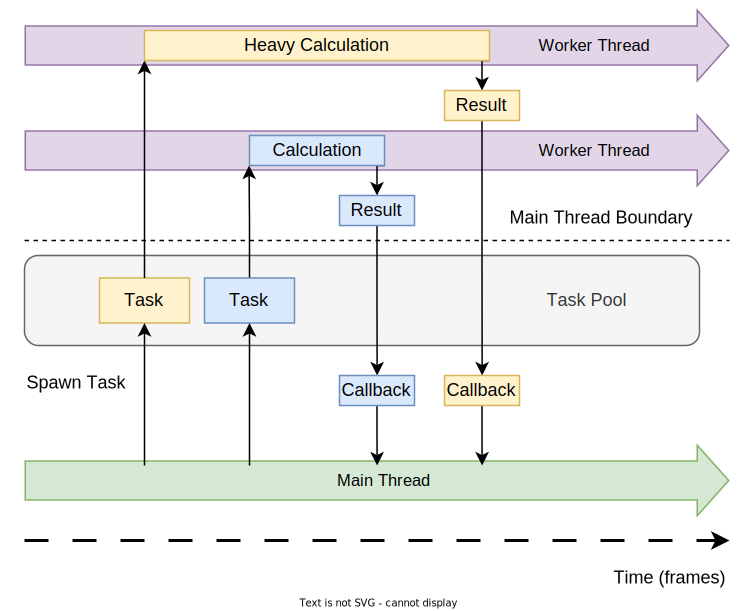

# Scripting

A game based on Fyrox is a plugin to the engine and the editor. Plugin defines global application logic and can provide
a set of scripts, that can be used to assign custom logic to scene nodes. Every script can be attached to only one 
plugin.

Fyrox uses scripts to create custom game logic, scripts can be written only in Rust which ensures that your game will
be crash-free, fast and easy to refactor.

Next chapters will cover all parts and will help you to learn how to use plugins + scripts correctly.

## Plugins

A game based on Fyrox is a plugin to the engine and the editor. Plugin defines global application logic and provides
a set of scripts, that can be used to assign custom logic to scene nodes.

Plugin is an "entry point" of your game, it has a fixed set of methods that can be used for initialization, update,
OS event handling, etc. Every plugin could be linked to the engine (and the editor) in two ways: statically or dynamically 
using hot reloading. [Code hot reloading](../beginning/hot_reloading.md) is usually used for development purposes only. 

The main purpose of the plugins is to hold and operate on some global application data, that can be used in scripts and
provide a set of scripts to the engine. Plugins also have much wider access to engine internals, than scripts. For example,
it is possible to change scenes, add render passes, change resolution, etc. which is not possible from scripts.

### Structure

Plugin structure is defined by [Plugin](https://docs.rs/fyrox/latest/fyrox/plugin/trait.Plugin.html) trait. Typical implementation can be generated by `fyrox-template` tool, 
and it looks something like this:

```rust,no_run
{{#include ../code/snippets/src/scripting/plugin.rs:plugin_structure}}
```

As you can see, the game structure (`struct Game`) implements a bunch of traits. 

- `Reflect` - is needed for static reflection to inspect the content of the plugin.
- `Visit` - is mostly needed for hot reloading, to save/load the content of the plugin. 
- `Default` - provides sensible default state of the game.

`Plugin` trait is very special - it can execute the actual game logic in one of its methods:

- `register` - called once on start allowing you to register your scripts. **Important:** You must register all your scripts here, otherwise the engine (and the editor) will know nothing about them. Also, you should register loaders for your custom resources here. See [Custom Resource chapter](../resources/custom.md) more info.
- `init` - called once when the plugin registers in the engine. This method allows you to initialize the game into some sensible state. Keep in mind, that the editor will **not** call this method, it does not create any game instance. The method has `scene_path` parameter, in short it is a path to a scene that is currently opened in the editor (it will be `None` if either there's no opened scene or your game was started outside the editor). It is described in [Editor and Plugins](#editor-and-plugins) section down below.
- `on_deinit` - it is called when the game is about to shut down. Can be used for any clean up, for example logging that the game has closed.
- `update` - it is called each frame at a stable rate (usually 60 Hz, but can be configured in the Executor) after the plugin is created and fully initialized. It is the main place where you should put _object-independent_ game logic (such as user interface handling, global application state management, etc.), any other logic should be added via scripts.
- `on_os_event` - it is called when the main application window receives an event from the operating system, it can be any event such as keyboard, mouse, game pad events or any other events. Please note that as for `update` method, you should put here only _object-independent_ logic. Scripts can catch OS events too.
- `on_ui_message` - it is called when there is a message from the user interface, it should be used to react to user actions (like pressed buttons, etc.)
- `on_graphics_context_initialized` - it is called when a graphics context was successfully initialized. This method could be used to access the renderer (to change its quality settings, for instance). You can also access a main window instance and change its properties (such as title, size, resolution, etc.).
- `on_graphics_context_destroyed` - it is called when the current graphics context was destroyed. It could happen on a small number of platforms, such as Android. Such platforms usually have some sort of suspension mode, in which you are not allowed to render graphics, to have a "window", etc.
- `before_rendering` - it is called when the engine is about to render a new frame. This method is useful to perform offscreen rendering (for example - [user interface](../ui/rendering.md#offscreen-rendering)).
- `on_scene_begin_loading` - it is called when the engine starts to load a game scene. This method could be used to show a progress bar or some sort of loading screen, etc.
- `on_scene_loaded` - it is called when the engine successfully loaded a game scene. This method could be used to add custom logic to do something with a newly loaded scene.

### Plugin Context

Vast majority of methods accept `PluginContext` - it provides almost full access to engine entities, it has access to the renderer, scenes container, resource manager, user interface, main application window. Typical content of the context is something like this:

```rust,no_run
{{#include ../code/snippets/src/scripting/context.rs:plugin_context}}
```

- `scenes` - a scene container, could be used to manage game scenes - add, remove, borrow. An example of scene loading is given in the previous code snippet in `Game::new()` method.
- `resource_manager` - is used to load external resources (scenes, models, textures, animations, sound buffers, etc.) from different sources (disk, network storage on WebAssembly, etc.)
- `user_interfaces` - use it to create user interface for your game, the interface is scene-independent and will remain the same even if there are multiple scenes created. There's always at least one user interface created, it can be accessed using `.first()/first_mut()` methods. The engine support unlimited instances of user interfaces.
- `graphics_context` - a reference to the graphics_context, it contains a reference to the window and the current renderer. It could be `GraphicsContext::Uninitialized` if your application is suspended (possible only on Android).
- `dt` - a time passed since the last frame. The actual value is implementation-defined, but on current implementation it is equal to 1/60 of a second and does not change event if the frame rate is changing (the engine stabilizes update rate for the logic).
- `lag` - a reference to the time accumulator, that holds remaining amount of time that should be used to update a plugin. A caller splits `lag` into multiple sub-steps using `dt` and thus stabilizes update rate. The main use of this variable, is to be able to reset `lag` when you're doing some heavy calculations in a game loop (i.e. loading a new level) so the engine won't try to "catch up" with all the time that was spent in heavy calculation.
- `serialization_context` - it can be used to register scripts and custom scene nodes constructors at runtime.
- `widget_constructors` - it can be used to register custom widgets.
- `performance_statistics` - performance statistics from the last frame. To get a rendering performance statistics, use `Renderer::get_statistics` method, that could be obtained from the renderer instance in the current graphics context.
- `elapsed_time` - amount of time (in seconds) that passed from creation of the engine. Keep in mind, that this value is **not** guaranteed to match real time. A user can change delta time with which the engine "ticks" and this delta time affects elapsed time.
- `script_processor` - a reference to the current script processor instance, which could be used to access a list of scenes that supports scripts.
- `async_scene_loader` - a reference to the current asynchronous scene loader instance. It could be used to request a new scene to be loaded.
- `window_target` - special field that associates main application event loop (not game loop) with OS-specific windows. It also can be used to alternate control flow of the application.
- `task_pool` - task pool for asynchronous task management.

### Control Flow

Plugin context provides access to a special variable `window_target`, which could be used to alternate control flow of the application. The most common use of it is to close the game by calling `window_target.unwrap().exit()` method. Notice the `unwrap()` here, `window_target` could not be available at all times. Ideally you should do checked access here.

### Editor and Plugins

When you're running your game from the editor, it starts the game as a separate process and if there's a scene opened in the editor, it tells the game instance to load it on startup. Let's look closely at `Plugin::init` method:

```rust,no_run
{{#include ../code/snippets/src/scripting/plugin.rs:plugin_init}}
```

The `scene_path` parameter is a path to a scene that is currently opened in the editor, your game should use it if you need to load a currently selected scene of the editor in your game. However, it is not strictly necessary - you may desire to start your game from a specific scene all the time, even when the game starts from the editor. If the parameter is `None`, then there is no scene loaded in the editor or the game was run outside the editor.

## Executor 

Executor is a simple wrapper that drives your game plugins, it is intended to be used for production builds of your game. The editor runs the executor in separate process when you're entering the play mode. Basically, there is no significant difference between running the game from the editor, or running it as a separate application. The main difference is that the editor passes `scene_path` parameter for the executor when entering the play mode.

### Usage

Executor is meant to be a part of your project's workspace, its typical look could something like this:

```rust,no_run
# extern crate fyrox;
# use fyrox::{
#     core::{pool::Handle, uuid::Uuid},
#     engine::executor::Executor,
#     plugin::{Plugin, PluginConstructor, PluginContext},
#     scene::{Scene},
# };
# struct GameConstructor;
# impl PluginConstructor for GameConstructor {
#     fn create_instance(
#         &self,
#         _scene_path: Option<&str>,
#         _context: PluginContext,
#     ) -> Box<dyn Plugin> {
#         todo!()
#     }
# }
fn main() {
    let mut executor = Executor::new();
    // Register your game constructor here.
    executor.add_plugin_constructor(GameConstructor);
    executor.run()
}
```

Executor has full access to the engine, and through it to the main application window. You can freely change desired parts, `Executor` implements `Deref<Target = Engine> + DerefMut` traits, so you can use its instance as an "alias" to engine instance. 

To add a plugin to the executor, just use `add_plugin_constructor` method, it accepts any entity that implements `PluginConstructor` traits.

### Typical Use Cases

This section covers typical use cases for the `Executor`.

#### Setting Window Title

You can set window title when creating executor instance:

```rust,no_run
# extern crate fyrox;
# use fyrox::engine::executor::Executor;
# use fyrox::window::WindowAttributes;
# use fyrox::engine::GraphicsContextParams;
# use fyrox::event_loop::EventLoop;
let executor = Executor::from_params(
    EventLoop::new().unwrap(),
    GraphicsContextParams {
        window_attributes: WindowAttributes {
            title: "My Game".to_string(),
            ..Default::default()
        },
        vsync: true,
    },
);
```

## Scripts

Script - is a container for game data and logic that can be assigned to a scene node. Fyrox uses Rust for scripting, so scripts are as fast as native code. Every scene node can have any number of scripts assigned.

### When to Use Scripts and When Not

Scripts are meant to be used to add data and some logic to scene nodes. That being said, you should not use scripts to hold some global state of your game (use your game plugin for that). For example, use scripts for your game items, bots, player, level, etc. On the other hand **do not** use scripts for leader boards, game menus, progress information, etc.

Also, scripts cannot be assigned to UI widgets due to intentional Game <-> UI decoupling reasons. All user interface components should be created and handled in the game plugin of your game.

### Script Structure

Typical script structure is something like this:

```rust,no_run
{{#include ../code/snippets/src/scripting/example.rs:example_script}}
```

Each script must implement following traits:

- `Visit` implements serialization/deserialization functionality, it is used by the editor to save your object to a scene file.
- `Reflect` implements compile-time reflection that provides a way to iterate over script fields, set their values, find fields by their paths, etc.
- `Debug` - provides debugging functionality, it is mostly for the editor to let it turn the structure and its fields into string.
- `Clone` - makes your structure clone-able, since we can clone objects, we also want the script instance to be cloned.
- `Default` implementation is very important - the scripting system uses it to create your scripts in the default state. This is necessary to set some data to it and so on. If it's a special case, you can always implement your own `Default`'s implementation if it's necessary for your script.
- `TypeUuidProvider` is used to attach some unique id for your type, every script **must** have a unique ID, otherwise, the engine will not be able to save and load your scripts. To generate a new UUID, use [Online UUID Generator](https://www.uuidgenerator.net/) or any other tool that can generate UUIDs.
- `ComponentProvider` - gives access to inner fields of the script marked with `#[component(include)]` attribute.

`#[visit(optional)]` attribute is used to suppress serialization errors when some fields are missing or changed. 

### Script Template Generator

You can use `fyrox-template` tool to generate all required boilerplate code for a new script, it makes adding new scripts much less tedious. To generate a new script use `script` command:

```shell
fyrox-template script --name MyScript
```

It will create a new file in `game/src` directory with `my_script.rs` name and fill with required code. Do not forget to add the module with the new script to `lib.rs` like this: 

```rust,no_run,compile_fail
// Use your script name instead of `my_script` here.
pub mod my_script;
```

Comments in each generated method should help you to figure out which code should be placed where and what is the purpose of every method.

> ⚠️ Keep in mind that every new script must be registered in `PluginConstructor::register`, otherwise you won't be able to assign the script in the editor to a node. See the next section for more info. 

### Script Registration

Every script must be registered before use, otherwise the engine won't "see" your script and won't let you assign it to an object. `PluginConstructor` trait has `register` method exactly for script registration. To register a script you need to register it in the list of script constructors like so:

```rust,no_run
{{#include ../code/snippets/src/scripting/example.rs:register}}
```

Every script type (`MyScript` in the code snippet above, you need to change it to your script type) must be registered using [ScriptConstructorsContainer::add](https://docs.rs/fyrox/latest/fyrox/script/constructor/struct.ScriptConstructorContainer.html#method.add) method, which accepts a script type as a generic argument and its name, that will be shown in the editor. The name can be arbitrary, it is used only in the editor. You can also change it at any time, it won't break existing scenes.

### Script Attachment

To assign a script and see it in action, run the editor, select an object and find `Scripts` property in the Inspector. Click on a small `+` button and select your script from the drop-down list on the newly added entry. To see the script in action, click "Play/Stop" button. The editor will run your game in separate process with the scene active in the editor.

The script can be attached to a scene node from code:

```rust,no_run
{{#include ../code/snippets/src/scripting/example.rs:add_my_script}}
```

Initialization as well as update of newly assigned script will happen on next update tick of the engine.

### Script Context

Script context provides access to the environment that can be used to modify engine and game state from scripts. Typical content of the context is something like this:

```rust,no_run
{{#include ../code/snippets/src/scripting/context.rs:context}}
```

- `dt` - amount of time passed since last frame. The value of the variable is implementation-defined, usually it is something like 1/60 (0.016) of a second.
- `elapsed_time` - amount of time that passed since start of your game (in seconds).
- `plugins` - a mutable reference to all registered plugins, it allows you to access some "global" game data that does not belong to any object. For example, a plugin could store key mapping used for player controls, you can access it using `plugins` field and find desired plugin. In case of a single plugin, you just need to cast the reference to a particular type using `context.plugins[0].cast::<MyPlugin>().unwrap()` call.
- `handle` - a handle of the node to which the script is assigned to (parent node). You can borrow the node using
`context.scene.graph[handle]` call. Typecasting can be used to obtain a reference to a particular node type.
- `scene` - a reference to parent scene of the script, it provides you full access to scene content, allowing you to add/modify/remove scene nodes.
- `scene_handle` - a handle of a scene the script instance belongs to.
- `resource_manager` - a reference to resource manager, you can use it to load and instantiate assets. 
- `message_sender` - a message sender. Every message sent via this sender will be then passed to every 
`ScriptTrait::on_message` method of every script.
- `message_dispatcher` - a message dispatcher. If you need to receive messages of a particular type, you must subscribe to a type explicitly.
- `task_pool` - task pool for asynchronous task management.
- `graphics_context` - Current graphics context of the engine.
- `user_interfaces` - a reference to user interface container of the engine. The engine guarantees that there's at least one user interface exists. Use `context.user_interfaces.first()/first_mut()` to get a reference to it.
- `script_index` - index of the script. Never save this index, it is only valid while this context exists!

### Execution order

Scripts have strictly defined execution order for their methods (the order if execution is linear and **do not** depend on actual tree structure of the graph where the script is located):

- `on_init` - called first for every script instance
- `on_start` - called after every `on_init` is called
- `on_update` - called zero or more times per one render frame. The engine stabilizes update rate of the logic, so if your game runs at 15 FPS, the logic will still run at 60 FPS thus the `on_update` will be called 4 times per frame. The method can also be not called at all, if the FPS is very high. For example, if your game runs at 240 FPS, then `on_update` will be called once per 4 frames.
- `on_message` - called once per incoming message.
- `on_os_event` - called once per incoming OS event.
- `on_deinit` - called at the end of the update cycle once when the script (or parent node) is about to be deleted.

If a scene node has multiple scripts assigned, then they will be processed as described above in the same order as they assigned to the scene node.

### Message passing

Script system of Fyrox supports message passing for scripts. Message passing is a mechanism that allows you to send some data (message) to a node, hierarchy of nodes or the entire graph. Each script can subscribe for a specific message type. It is an efficient way for decoupling scripts from each other. For instance, you may want to detect and respond to some event in your game. In this case when the event has happened, you send a message of a type and every "subscriber" will react to it. This way subscribers will not know anything about sender(s); they'll only use message data to do some actions.

A simple example where the message passing can be useful is when you need to react to some event in your game. Imagine, that you have weapons in your game, and they can have a laser sight that flashes with a different color when some target was hit. In very naive approach you can handle all laser sights where you handle all intersection for projectiles, but this adds a very tight coupling between laser sight and projectiles. This is totally unnecessary coupling can be made loose by using message passing. Instead of handling laser sights directly, all you need to do is to broadcast an `ActorDamaged { actor: Handle<Node>, attacker: Handle<Node> }` message. Laser sight in its turn can subscribe for such message and handle all incoming messages and compare `attacker` with owner of the laser sight and if the hit was made by `attacker` flash with some different color. In code this would like so:

```rust,no_run
{{#include ../code/snippets/src/scripting/mod.rs:message_passing}}
```

There are few key parts:

- You should explicitly subscribe script instance to a message type, otherwise messages of the type won't be delivered to your script. This is done using the message dispatcher: `ctx.message_dispatcher.subscribe_to::<Message>(ctx.handle);`. This should be done in `on_start` method, however it is possible to subscribe/unsubscribe at runime.
- You can react to messages only in special method `on_message` - here you just need to check for message type using pattern matching and do something useful.

Try to use message passing in all cases, loose coupling significantly improves code quality and readability, however in simple projects it can be ignored completely.

### Accessing Other Script's Data

Every script "lives" on some scene node, so to access a script data from some other script you need to know a handle of a scene node with that script first. You can do this like so:

```rust,no_run
{{#include ../code/snippets/src/scripting/mod.rs:access_other_1}}
{{#include ../code/snippets/src/scripting/mod.rs:access_other_2}}
```

In this example we have the two script types: `MyScript` and `MyOtherScript`. Now imagine that we have two scene nodes, where the first one contains `MyScript` and the second one `MyOtherScript`. `MyScript` knows about the second node by storing a handle of in `second_node` field. `MyScript` waits until `MyOtherScript` will count its internal counter to `60.0` and then prints a message into the log. This code does immutable borrowing and does not allow you to modify other script's data. If you a mutable access, then use `try_get_script_of_mut` method (or `try_get_script_mut` for the alternative code). `second_node` field of the `MyScript` is usually assigned in the editor, but you can also find the node in your scene by using the following code:

```rust,no_run
{{#include ../code/snippets/src/scripting/mod.rs:find_node}}
```

This code searches for a node with `SomeName` and assigns its handle to the `second_node` variable in the script for later use.

## Tasks

Fyrox supports task-based programming for both scripts and plugins. Task is a closure that does something in a separate thread and then the result of it is returned back to the main thread. This is very useful technique, that allows you to perform heavy calculations using all available CPU power, not just one CPU core with a single main thread. Tasks could be used for pretty much anything, that can be done as a separate piece of work. 

### How it works

Main thread spawns a task which is then sent to the task pool. There's a fixed set of worker threads, that extracts tasks from the task pool when there's any. Task's code is then executed in one of the worker thread, which may take any amount of time. When the task is completed, its result is sent to the main thread and then a callback closure is executed to do a desired action on task completion. Usually it's something relatively fast - for example you may spawn a task that calculates a path on a large navigational mesh and when it is done, you store that path in one of your script instance from which the task was spawned. As you can see, there are two major parts - the task itself and the closure. Graphically it can be represented like this:



Green line represents the main thread and the two purple lines are the worker threads. There could be any number of worker threads, and usually it is a worker thread per each CPU core. Let's take a look at a typical task path on this image (yellow-ish one). At first, we spawn a task, and it is immediately put in the task pool (in the same thread), after this if we have a free worker thread it extracts our task from the pool and sends it to execution. As you can see any task must implement `Send` trait, otherwise you'll get a _compilation error_. When the task is complete, the worker thread sends the result (again, the result must be `Send`) to the main thread and an associated callback closure is executed to do something with the result. While the task is being executed, the main thread is not blocked, and it can do other useful stuff. 

### Examples

The following example calculates a path on a navigational mesh in using task-based approach described above. At first, it prepares the "environment" for the task by cloning a shared navigational mesh (`Arc<RwLock<NavMesh>>`) into a local variable. Then it spawns a new task (`async move { .. }` block) which reads the shared navigational mesh and calculates a long path, that could take a few frames to compute (imagine a huge island, and we need to get a path from one corner to another). As the last argument to the `spawn_script_task` method we pass a closure that will be executed on the main thread when the task is complete. It just saves the computed path in the script's field which is then used for visualization.

```rust,no_run
{{#include ../code/snippets/src/scripting/tasks.rs:script_task}}
```

Plugins could also spawn tasks, which operates on application scale basis, unlike script tasks which operates with separate script instances. A plugin task is a bit easier to use:

```rust,no_run
{{#include ../code/snippets/src/scripting/tasks.rs:plugin_task}}
```

### Performance

You should avoid task-based approach for small (in time terms) tasks, because each task has additional cost which might be larger than the actual task executed in-place. This is because you need to send your task to a separate thread using a channel, then the callback closure is stored as a trait object which involves memory allocation. Since tasks uses type erasure technique, they perform dynamic type casting which is not free. Also, there could be any other implementation-defined "slow" spots.

A general advice would be: run a profiler first to find hot spots in your game, then try to optimize them. If you hit the optimization limit, use tasks. Do not use tasks until you really need them, try to optimize your game first! If you're working on a simple 2D game, you'll never need to use tasks. You might need to use tasks when your have, for instance, a procedurally generated world that should be generated on the fly. For example, if you're making a dungeon crawler with infinite world. Tasks are also very useful for large games with loads of content and activities. You could off-thread AI, world manipulation (for example if you have a destructible world), etc. In other words - do not use a sledgehammer to hammer nails, unless you have a _huge_ nail.