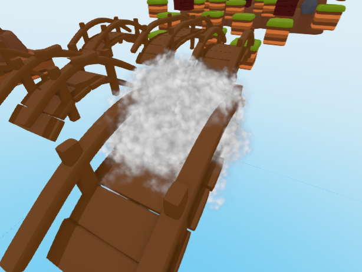
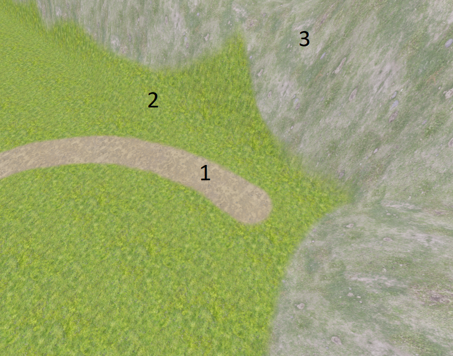
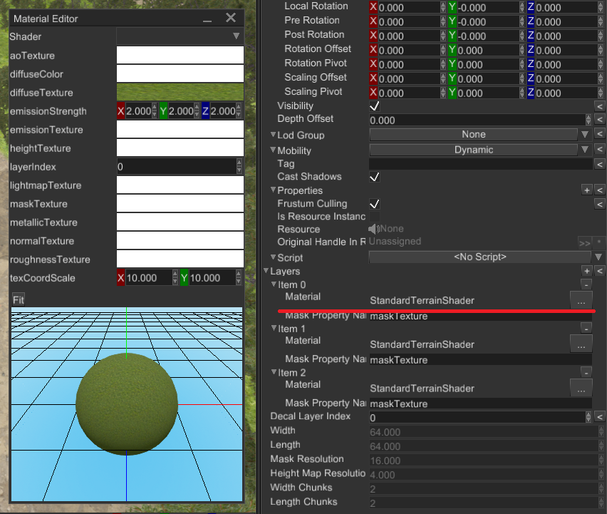

# Scene

Scene is a container for game entities. Currently, scenes in the engine manage following entities:

1)  Graph
2)  Animations
3)  Physics (rigid bodies, colliders, joints)
4)  Sound

Scene allows you to create isolated "world" which won't interact with other scenes, it is very useful for many more or less complex games.

### How to create

A scene could be created either in FyroxEd or programmatically. You can also combine both approaches, where you build all "static" content in the editor and adding rest of the entities (bots, interactive objects, etc.) manually by instantiating respective prefabs at runtime.

#### Using FyroxEd

There is a [separate chapter](../beginning/editor_overview.md) in the book that should help you to create a scene. After a scene is created, you can load it using async scene loader:

``` rust,no_run
{{#include ../code/snippets/src/scene/mod.rs:load_scene}}
```

The code is quite straightforward. At first, we're using async scene loader to create a scene loading request. This request will be processed in a separate thread, leaving your game fully responsible while the scene is loading. Next, when the scene is fully loaded and added to the engine, `on_scene_loaded` method is called. Usually there's only one active scene, so we're removing the previous one and setting the new one as active.

There are two additional methods:

1)  `on_scene_begin_loading` - is called when a scene is just began to load. Keep in mind, that async scene loader could load multiple scenes at once and this method is guaranteed to be called exactly before the scene is started to load.
2)  `on_scene_loading_failed` - is called when a scene is failed to load. This method could be useful if you're using non-verified scenes (i.e. from game mods) and want to react somehow when the scene is failed to load.

#### Create scene manually

A scene could also be created manually:

``` rust,no_run
{{#include ../code/snippets/src/scene/mod.rs:create_scene}}
```

See respective node builders [docs](../scene/graph.md#using-node-builders) to populate the scene.

### Where all my scenes located?

All scenes "lives" in the engine, the engine has ownership over your scene after you've added it in the engine. You can borrow a scene at any time using its handle and do some changes:

``` rust,no_run
{{#include ../code/snippets/src/scene/mod.rs:scene_borrowing}}
```

### Building scene asynchronously

You can create your scene in separate thread and then pass it to main thread to insert it in the engine. Why this is needed? Remember the last time you've played a relatively large game, you've probably noticed that it have loading screens and loading screen has some fancy interactive stuff with progress bar. Loading screen is fully responsive while the game doing hard job loading the world for you. Got it already? Asynchronous scene loading is needed to create/load large scenes with tons of resources without blocking main thread, thus leaving the game fully responsive.

### Managing multiple scenes

Usually you should have only one scene active (unless you're making something very special), you should use `.enabled` flag of a scene to turn it off or on. Deactivated scenes won't be rendered, the physics won't be updated, the sound will stop, and so on. In other words the scene will be frozen. This is useful for situations when you often need to switch between scenes, leaving other scene in frozen state. One of the examples where this can be useful is menus. In most games when you're entering the menu, game world is paused.

### Ambient lighting

Every scene has default ambient lighting, it is defined by a single RGB color. By default, every scene has some pre-defined ambient lighting, it is bright enough, so you can see your objects. In some cases you may need to adjust it or even make it black (for horror games for instance), this can be achieved by a single line of code:

``` rust,no_run
{{#include ../code/snippets/src/scene/mod.rs:set_ambient_lighting}}
```

Please keep in mind that ambient lighting does not mean global illumination, it is a different lighting technique which is not available in the engine yet.

## Graph

Graph is a set of objects with hierarchical relationships between each object. It is one of the most important entities in the engine. Graph takes care of your scene objects and does all the hard work for you.

### How to create

You don't need to create a graph manually, every scene has its own instance of the graph. It can be accessed pretty easily: `scene_ref.graph`

### Adding nodes

There are two ways of adding nodes to the graph, either using *node builders* or manually by calling `graph.add_node`.

#### Using node builders

Every node in the engine has its respective builder which can be used to create an instance of the node. Using builders is a preferable way to create scene nodes. There are following node builders:

1)  `BaseBuilder` - creates an instance of base node. See [Base node](./base_node.md) for more info.
2)  `PivotBuilder` - creates an instance of pivot node. See [Base node](./base_node.md) for more info.
3)  `CameraBuilder` - creates an instance of camera node. See [Camera node](./camera_node.md) for more info.
4)  `MeshBuilder` - creates an instance of mesh node. See [Mesh node](./mesh_node.md) for more info.
5)  `LightBuilder` - creates an instance of light node. See [Light node](./light_node.md) for more info.
6)  `SpriteBuilder` - creates an instance of sprite node. See [Sprite node](./sprite_node.md) for more info.
7)  `ParticleSystemBuilder` - creates an instance of particle system node. See [Particle system node](./particle_system_node.md) for more info.
8)  `TerrainBuilder` - creates an instance of terrain node. See [Terrain node](./terrain_node.md) for more info.
9)  `DecalBuilder` - creates an instance of decal node. See [Decal node](./decal_node.md) for more info.
10) `RigidBody` - creates an instance of rigid body node. See [Rigid body](../physics/rigid_body.md) for more info.
11) `Collider` - creates an instance of collider node. See [Collider](../physics/collider.md) for more info.
12) `Joint` - creates an instance of joint node. See [Joint](../physics/joint.md) for more info.
13) `Rectangle` - creates an instance of 2D rectangle node. See [Rectangle](./rectangle.md) for more info.

Every builder, other than `BaseBuilder`, accepts `BaseBuilder` as a parameter in `.new(..)` method. Why so? Because every node (other than Base) is "derived" from Base via composition and the derived builder must know how to build Base node. While it may sound confusing, it is actually very useful and clear. Consider this example:

``` rust,no_run
{{#include ../code/snippets/src/scene/graph.rs:create_camera}}
```

As you can see, we're creating an instance of BaseBuilder and fill it with desired properties as well as filling the CameraBuilder's instance properties. This is a very flexible mechanism, allowing you to build complex hierarchies in a declarative manner:

``` rust,no_run
{{#include ../code/snippets/src/scene/graph.rs:create_node}}
```

This code snippet creates a camera for first-person role-playing game's player, it will have a staff in "right-hand" and a spell in the left hand. Of course all of this is very simplified, but should give you the main idea. Note that staff and fireball will be children nodes of camera, and when setting their transform, we're actually setting **local** transform which means that the transform will be relative to camera's. The staff and the spell will move together with the camera.

#### Adding a node manually

For some rare cases you may also want to delay adding a node to the graph, specifically for that purpose, every node builder has `.build_node` method which creates an instance of `Node` but does not add it to the graph.

``` rust,no_run
{{#include ../code/snippets/src/scene/graph.rs:create_node_manually}}
```

### How to modify the hierarchy

For many cases you can't use builders to create complex hierarchy, the simplest example of such situation when you're creating an instance of some 3D model. If you want the instance to be a child object of some other object, you should attach it explicitly by using `graph.link_nodes(..)`:

``` rust,no_run
{{#include ../code/snippets/src/scene/graph.rs:link_weapon_to_camera}}
```

Here we've loaded a weapon 3D model, instantiated it on scene and attached to *existing* camera.

### How to remove nodes

A node could be removed by simply calling `graph.remove_node(handle)`, this method removes the node from the graph **with all of its children nodes**. Sometimes this is unwanted behavior, and you want to preserve children nodes while deleting parent node. To do that, you need to explicitly detach children nodes of the node you're about to delete:

``` rust,no_run
{{#include ../code/snippets/src/scene/graph.rs:remove_preserve_children}}
```

After calling this function, every child node of `node_to_remove` will be detached from it and the `node_to_remove` will be deleted. `remove_node` has some limitations: it cannot be used to extract "sub-graph" from the graph, it just drops nodes immediately.

## Transformation

Transformation (transform for short) - is a special entity that changes coordinate system from one to another. It is used primarily in scene nodes to store their position/rotation/scale/pivots/etc. Fyrox has quite complex transformations, that supports:

1)  Position (`T`)
2)  Rotation (`R`)
3)  Scale (`S`)
4)  Pre-rotation (`Rpre`)
5)  Post-rotation (`Rpost`)
6)  Rotation Pivot (`Rp`)
7)  Rotation Offset (`Roff`)
8)  Scaling Offset (`Soff`)
9)  Scaling Pivot (`Sp`)

Final transformation matrix will be `Transform = T * Roff * Rp * Rpre * R * Rpost * Rp⁻¹ * Soff * Sp * S * Sp⁻¹`. In 99.9% cases first three are enough for pretty much every task. Other six components used for specific stuff (mainly for nodes that imported from FBX file format).

## Prefabs

A prefab is a separate scene that can be instantiated in some other scene, while preserving links between properties of its instances and of its parent prefab. Prefabs allow you to create a part of a scene and have multiple instances of it in other scenes.

Let's quickly check what that means on practice. The engine has a prefab system which allows you to build hierarchical scenes which can include any number of other scenes as child scenes. Child scenes can have their own child scenes and so on. This is very efficient decoupling mechanism that allows you to put pieces of the scene in separate scenes (prefabs) and modify them independently. The changes in child scenes will be automatically reflected to all parent scenes. Here is the very simple example of why this is important: imagine you need to populate a town with 3D models of cars. Each kind of car has its own 3D model and for example, a collision body that won't allow the player to walk through cars. How would you do this? The simplest (and dumbest) solution is to copy dozens of car models in the scene, and you're done. Imagine that now you need to change something in your car, for example, add a trunk that can be opened. What will you do? Of course, you should "iterate" over each car model and do the required changes, you simply don't have any other option. This will eat huge amount of time and in general it is very non-productive.

This is where prefabs will save you hours of work. All you need to do is to create a car prefab and instantiate it multiple times in your scene. When you'll need to change something in the car, you simply go to the prefab and change it. After that every prefab instance will have your changes!

Prefabs can be used to create self-contained entities in your game, examples of this includes: visual effects, any scripted game entities (bots, turrets, player, doors, etc.). Such prefabs can be either directly instantiated in a scene in the editor, or instantiated at runtime when needed.

### How to create and use a prefab

All you need to do is to make a scene in the editor with all required objects and save it! After that, you can use the scene in other scenes and just do its instantiation, as in usual 3D models. You can either instantiate it from the editor by drag'n'drop a prefab to scene previewer, or do standard [model resource instantiation](../resources/model.md#instantiation)

### Property inheritance

As already mentioned in the intro section, instances inherit properties from their parent prefabs. For example, you can change position of an object in prefab and every instance will reflect that change - the object's instances will also move. This works until there's no manual change to a property in instance, if you do so, your change is considered with higher priority. See [this chapter](./inheritance.md) for more info.

### Hierarchical Prefabs

Prefabs can have other prefab instances inside it. This means that you can, for example, create a room populated with instances of other prefabs (bookshelves, chairs, tables, etc.) and then use the room prefab to build a bigger scene. The changes in the base prefabs will be reflected in their instances, regardless of how deep the hierarchy is.

## Property Inheritance

Property inheritance is used to propagate changes of unmodified properties from a prefab to its instances. For example, you can change scale of a node in a prefab and its instances will have the same scale too, unless the scale is set explicitly in an instance. Such feature allows you to tweak instances, add some unique details to them, but take general properties from parent prefabs.

Property inheritance works for prefab hierarchies of any depth, this means that you can create something like this: a room prefab can have multiple instances of various furniture prefabs in it, while the furniture prefabs can also be constructed from other prefabs and so on. In this case if you modify a property in one of the prefabs in the chain, all instance will immediately sync their unmodified properties.

### How To Create Inheritable Properties

It is possible to use property inheritance for script variables. To make a property of your script inheritable, all you need is to wrap its value using `InheritableVariable` wrapper.

``` rust,no_run
{{#include ../code/snippets/src/scene/inheritance.rs:my_script}}
```

The engine will automatically resolve the correct value for the property when a scene with the script is loaded. If your property was modified, then its value will remain the same, it won't be overwritten by parent's value. Keep in mind, that the type of the inheritable variable must be cloneable and support reflection.

`InheritableVariable` implements the `Deref<Target = T> + DerefMut` traits, this means that any access via the `DerefMut` trait will mark the property as modified. This could be undesired in some cases so `InheritableVariable` supports special `xxx_silent` methods that don't touch the internal modifiers and allows you to substitute the value with some other "silently" - without marking the variable as modified.

### Which Fields Should Be Inheritable?

Inheritable variables intended to be "atomic" - it means that the variable stores some simple variable (`f32`, `String`, `Handle<Node>`, etc.). While it is possible to store "compound" variables (`InheritableVariable<YourStruct>`), it is not advised because of inheritance mechanism. When the engine sees inheritable variable, it searches the same variable in a parent entity and copies its value to the child, thus completely replacing its content. In this case, even if you have inheritable variables inside compound field, they won't be inherited correctly. Let's demonstrate this in the following code snippet:

``` rust,no_run
{{#include ../code/snippets/src/scene/inheritance.rs:complex_inheritance}}
```

This code snippet should clarify, that inheritable fields should contain some "simple" data, and almost never - complex structs.

### Editor

The editor wraps all inheritable properties in a special widget that supports property reversion. Reversion allows you to drop current changes and take the parent's property value. This is useful if you want a property to inherit its parent's value. In the Inspector it looks like this:


Clicking on the `<` button will take the value from the parent prefab and the property won't be marked as modified anymore. In case there is no parent prefab, the button will just drop `modified` flag.

## Base node

Base node is a scene node that stores hierarchical information (a handle to the parent node and a set of handles to children nodes), local and global transform, name, tag, lifetime, etc. It has self-describing name - it is used as a base node for every other scene node (via composition).

It has no graphical information, so it is invisible all the time, but it is useful as a "container" for children nodes.

### How to create

Use the `PivotBuilder` to create an instance of the Pivot node (remember `Base` node itself is used only to build other node types):

``` rust,no_run
{{#include ../code/snippets/src/scene/base.rs:build_node}}
```

### Building a complex hierarchy

To build a complex hierarchy of some nodes, use `.with_children()` method of the `BaseBuilder`, it allows you to build a hierarchy of any complexity:

``` rust,no_run
{{#include ../code/snippets/src/scene/base.rs:build_complex_node}}
```

Note that when we're building a `Camera` instance, we're passing a new instance of `BaseBuilder` to it, this instance can also be used to set some properties and a set of children nodes.

The "fluent syntax" is not mandatory to use, the above code snipped could be rewritten like this:

``` rust,no_run
{{#include ../code/snippets/src/scene/base.rs:build_complex_node_flat}}
```

However, it looks less informative, because it loses the hierarchical view and it is harder to tell the relations between objects.

### Transform

Base node has a local transform that allows you to translate/scale/rotate/etc. your node as you want to. For example, to move a node at specific location you could use this:

``` rust,no_run
{{#include ../code/snippets/src/scene/base.rs:translate_node}}
```

You could also chain multiple `set_x` calls, like so:

``` rust,no_run
{{#include ../code/snippets/src/scene/base.rs:transform_node}}
```

See more info about transformations [here](./transform.md).

### Visibility

`Base` node stores all info about local visibility and global visibility (with parent's chain visibility included). Changing node's visibility could be useful if you want to improve performance by hiding distant objects (however it strongly advised to use level-of-detail for this) or to hide some objects in your scene. There are three main methods to set or fetch visibility:

-   `set_visibility` - sets local visibility for a node.
-   `visibility` - returns current local visibility of a node.
-   `global_visibility` - returns combined visibility of a node. It includes visibility of every parent node in the hierarchy, so if you have a parent node with some children nodes and set parent's visibility to `false`, global visibility of children nodes will be `false` too, even if local visibility is `true`. This is useful technique for hiding complex objects with lots of children nodes.

### Enabling/disabling scene nodes

A scene node could be enabled or disabled. Disabled nodes are excluded from a game loop and has almost zero CPU consumption (their global transform/visibility/enabled state is still updated due to limitations of the engine). Disabling a node could be useful if you need to completely freeze some hierarchy and do keep it in this state until it is enabled again. It could be useful to disable parts of a scene with which a player cannot interact to improve performance. Keep in mind, that enabled state is hierarchical like visibility. When you're disabling a parent node with some children nodes, the children nodes will be disabled too.

## Mesh node

Mesh is a scene node that represents a 3D model. This one of the most commonly used nodes in almost every game. Meshes could be easily created either programmatically or be made in some 3D modelling software (like Blender) and loaded in your scene.

### Surfaces

Surface is a set of triangles that uses the same [material](../rendering/materials.md). Mesh node could contain zero of more surfaces; each surface contains a set of vertices and indices that binds vertices with triangles. Mesh nodes split into surfaces to be rendered effectively by modern GPUs.

### How to create

There are basically two ways, how to pick one depends on your needs. In general, using a 3D modelling software is the way to go, especially with tons and tons of free 3D models available online.

> ⚠️ The engine supports *only* FBX and GLTF file format for 3D models! To use GLTF, specify `gltf` feature of the engine in your root Cargo.toml

#### Using a 3D modelling software

To create a 3D model, you could use [Blender](https://www.blender.org/) and then export it to `FBX` file format. To load your 3D model in the game, you should do few simple steps (loading a 3D model does not differ from a prefab instantiation):

``` rust,no_run
{{#include ../code/snippets/src/scene/mesh.rs:load_model_to_scene}}
```

This code snippet intentionally omits proper `async/await` usage (instead it just blocks current thread until model is loading) and error handling. In the real game you should carefully handle all errors and use `async/await` properly.

#### Creating a procedural mesh

A mesh instance could be created from code, such meshes are called "procedural". They're suitable for cases when you cannot create a mesh in 3D modelling software.

``` rust,no_run
{{#include ../code/snippets/src/scene/mesh.rs:create_procedural_mesh}}
```

As you can see, creating a mesh procedurally requires lots of manual work and not so easy.

### Animation

Mesh node supports bone-based animation (skinning) and blend shapes. See [Animation chapter](./../animation/animation.md) for more info.

### Data Buffers

It is possible to access vertex buffer and index buffer of a mesh to either read or write some data there. For example, the following code extracts world-space positions of every vertex of an animated mesh:

``` rust,no_run
{{#include ../code/snippets/src/scene/mesh.rs:extract_world_space_vertices}}
```

## Light node

The engine offers complex lighting system with various types of light sources.

### Light types

There are three main types of light sources: directional, point, and spotlights.

#### Directional light

Directional light does not have a position, its rays are always parallel, and it has a particular direction in space. An example of directional light in real-life could be our Sun. Even if it is a point light, it is so far away from the Earth, so we can assume that its rays are always parallel. Directional light sources are suitable for outdoor scenes.

A directional light source could be created like this:

``` rust,no_run
{{#include ../code/snippets/src/scene/light.rs:create_directional_light}}
```

By default, the light source will be oriented to lit "the ground". In other words its direction will be faced towards `(0.0, -1.0, 0.0)` vector. You can rotate it as you want by setting local transform of it while building. Something like this:

``` rust,no_run
{{#include ../code/snippets/src/scene/light.rs:create_oriented_directional_light}}
```

#### Point light

Point light is a light source that emits lights in all directions, it has a position, but does not have an orientation. An example of a point light source: light bulb.

``` rust,no_run
{{#include ../code/snippets/src/scene/light.rs:create_point_light}}
```

#### Spotlight

Spotlight is a light source that emits lights in cone shape, it has a position and orientation. An example of a spotlight source: flashlight.

``` rust,no_run
{{#include ../code/snippets/src/scene/light.rs:create_spot_light}}
```

### Light scattering


Spot and point lights support light scattering effect. Imagine you're walking with a flashlight in a foggy weather, the fog will scatter the light from your flashlight making it, so you'll see the "light volume". Light scattering is **enabled by default**, so you don't have to do anything to enable it. However, in some cases you might want to disable it, you can do this either while building a light source or change light scattering options on existing light source. Here is the small example of how to do that.

``` rust,no_run
{{#include ../code/snippets/src/scene/light.rs:disable_light_scatter}}
```

You could also change the amount of scattering per each color channel, using this you could imitate the [Rayleigh scattering](https://en.wikipedia.org/wiki/Rayleigh_scattering):

``` rust,no_run
{{#include ../code/snippets/src/scene/light.rs:use_rayleigh_scattering}}
```

### Shadows

By default, light sources cast shadows. You can change this by using `set_cast_shadows` method of a light source. You should carefully manage shadows: shadows giving the most significant performance impact, you should keep the amount of light sources that can cast shadows at lowest possible amount to keep performance at good levels. You can also turn on/off shadows when you need:

``` rust,no_run
{{#include ../code/snippets/src/scene/light.rs:switch_shadows}}
```

Not every light should cast shadows, for example a small light that a player can see only in a distance can have shadows disabled. You should set the appropriate values depending on your scene, just remember: the fewer the shadows the better the performance. The most expensive shadows are from point lights, the less, from spotlights and directional lights.

### Performance

Lights are not cheap, every light source has some performance impact. As a general rule, try to keep the amount of light sources at reasonable levels and especially try to avoid creating tons of light sources in a small area. Keep in mind that the less area the light needs to "cover", the higher the performance. This means that you can have tons of small light sources for free.

## Sprite

Sprite is just a quad mesh that is always facing camera. It has size, color, rotation around "look" axis and a texture. Sprites are useful mostly for projectiles, like glowing plasma, and for things that should always face a camera.

> ⚠️ It should be noted that **sprites are not meant to be used for 2D games**, they're only for 3D. Use [Rectangle node](./rectangle.md) if you need 2D sprites.

### How to create

A sprite instance could be created using `SpriteBuilder`:

``` rust,no_run
{{#include ../code/snippets/src/scene/sprite.rs:create_sprite}}
```

A sprite with a texture could be created by using `.with_material` method of the builder:

``` rust,no_run
{{#include ../code/snippets/src/scene/sprite.rs:create_sprite_with_texture}}
```

Please note, that this code create a material per each sprite. This could be very unoptimal if you're using tons of sprites at once, share the same material resource across multiple sprites if you can. Otherwise, each sprite will be rendered in a separate draw call and the overall performance will be very low.

### Animation

See [Sprite Animation](../animation/spritesheet/spritesheet.md) chapter for more info.

### General rules

Sprites **must not** be used to create any visual effects that involve many particles. You should use [particle systems](particle_system_node.md) for that. Why so? Particles systems are very well optimized for managing huge amounts of particles at the same time, but sprites are not. Each sprite is quite heavy to be used as a particle in particle systems, it has a lot of "useless" info that will eat a lot of memory.

## Particle system

Particle system is a scene node that is used to create complex visual effects (VFX). It operates on huge amount of particles at once allowing you to do complex simulation that involves large amount of particles. Typically, particle systems are used to create following visual effects: smoke, sparks, blood splatters, steam, etc.



### Basic Concepts

Particle system uses *single* texture for every particle in the system, only Red channel is used. Red channel interpreted as an alpha for all particles.

Every particle is affected by `Acceleration` parameters of the particle system. It defines acceleration (in m/s<sup>2</sup>) that will affect velocities of every particle. It is used to simulate gravity.

#### Particle

Particle is a square (not quadrilateral, this is important) with a texture which is always facing towards camera. It has the following properties:

-   `Position` - defines a position in *local* coordinates of particle system (this means that if you rotate a particle system, all particles will be rotated too).
-   `Velocity` - defines a speed vector (in local coordinates) that will be used to modify local position of the particle each frame.
-   `Size` - size (in meters) of the square shape of the particle.
-   `Size Modifier` - a numeric value (in meters per second), that will be added to the Size at each frame, it is used to modify size of the particles.
-   `Lifetime` - amount of time (in seconds) that the particle can be active for.
-   `Rotation` - angle (in radians) that defines rotation around particle-to-camera axis (clockwise).
-   `Rotation Speed` - speed (in radians per second, rad/s) of rotation of the particle.
-   `Color` - RGBA color of the particle.

#### Emitters

Particle system uses *emitters* to define a set of zones where particles will be spawned, it also defines initial ranges of parameters of particles. Particle system must have at least one emitter to generate particles.

Emitter can be one of the following types:

-   `Cuboid` - emits particles uniformly in a cuboid shape, the shape cannot be rotated, only translated.
-   `Sphere` - emits particles uniformly in a sphere shape.
-   `Cylinder` - emits particle uniformly in a cylinder shape, the shape cannot be rotated, only translated.

Each emitter have fixed set of parameters that affects *initial* values for every spawned particle:

-   `Position` - emitter have its own *local* position (position relative to parent particle system node), this helps you to create complex particle systems that may spawn particles from multiple zones in space at once.
-   `Max Particles` - maximum amount of particles available for spawn. By default, it is `None`, which says that there is no limit.
-   `Spawn Rate` - rate (in units per second) defines how fast the emitter will spawn particles.
-   `Lifetime Range` - numeric range (in seconds) for particle lifetime values. The lower the beginning of the range the less spawned particles will live, and vice versa.
-   `Size Range` - numeric range (in meters) for particle size.
-   `Size Modifier Range` - numeric range (in meters per second, m/s) for particle size modifier parameter.
-   `X/Y/Z Velocity Range` - a numeric range (in meters per second, m/s) for a respective velocity axis (X, Y, Z) that defines initial speed along the axis.
-   `Rotation Range` - a numeric range (in radians) for initial rotation of a new particle.
-   `Rotation Speed Range` - a numeric range (in radians per second, rad/s) for rotation speed of a new particle.

**Important:** Every range (like Lifetime Range, Size Range, etc.) parameter generates *random* value for respective parameter of a particle. You can tweak the seed of current random number generator (`fyrox::core::thread_rng()`) to ensure that generated values will be different each time.

### How to create

There are multiple ways of creating a particle system, pick one that best suits your current needs.

#### Using the editor

The best way to create a particle system is to configure it in the editor, creating from code is possible too (see below), but way harder and may be not intuitive, because of the large amount of parameters. The editor allows you see the result and tweak it very fast. Create a particle system by `Create -> Particle System` and then you can start editing its properties. By default, new particle system has one Sphere particle emitter, you can add new emitters by clicking `+` button at the right of `Emitters` property in the Inspector (or remove by clicking `-`). Here's a simple example:


Now start tweaking desired parameters, it is hard to give any recommendations of how to achieve a particular effect, only practice matters here.

#### Using the code

You can also create particle systems from code (in case if you need some procedurally-generated effects):

``` rust,no_run
{{#include ../code/snippets/src/scene/particle_system.rs:create_smoke}}
```

This code creates smoke effect with smooth dissolving (by using color-over-lifetime gradient). Please refer to [API docs](https://docs.rs/fyrox/latest/fyrox/scene/particle_system/index.html) for particle system for more information.

#### Using prefabs

If you need to create particle systems made in the editor, you can always use prefabs. Create a scene with desired particle system and then [instantiate](../resources/model.md#instantiation) it to your scene.

### Soft particles

Fyrox used special technique, called soft particles, that smooths sharp transitions between particles and scene geometry:


This technique especially useful for effects such as smoke, fog, etc. where you don't want to see the "edge" between particles and scene geometry. You can tweak this effect using `Soft Boundary Sharpness Factor`, the larger the value the more "sharp" the edge will be and vice versa.

### Restarting emission

You can "rewind" particle systems in the "initial" state by calling `particle_system.clear_particles()` method, it will remove all generated particles and emission will start over.

### Enabling or disabling particle systems

By default, every particle system is enabled. Sometimes there is a need to create a particle system, but not enable it (for example for some delayed effect). You can achieve this by calling `particle_system.set_enabled(true/false)` method. Disabled particle systems will still be drawn, but emission and animation will be stopped. To hide particle system completely, use `particle_system.set_visibility(false)` method.

### Performance

Particle systems using special renderer that optimized to draw millions of particles with very low overhead, however particles simulated on CPU side and may significantly impact overall performance when there are many particle systems with lots of particles in each.

### Limitations

Particle systems does not interact with lighting, this means that particles will not be lit by light sources in the scene.

## Terrain

Terrain is a scene node that represents uniform grid of cells where each cell can have different height. Other, commonly known name for terrain is heightmap. Terrains used to create maps for open-world games, it is used to create hills, mountains, plateau, roads, etc.


### Basic concepts

There are few basic concepts that you should understand before trying to use terrains. This will help you to understand design decisions and potential use cases.

#### Heightmap

As it was already mentioned, terrain is a uniform grid where X and Z coordinates of cells have fixed values, while Y can change. In this case we can store only width, height and resolution numerical parameters to calculate X and Z coordinates, while Y is stored in a separate array which is then used to modify heights of cells. Such array is called *heightmap*.


#### Layers

Layer is a material + mask applied to terrain's mesh. Mask is a separate, greyscale texture that defines in which parts of the terrain the material should be visible or not. White pixels in the mask makes the material to be visible, black - completely transparent, everything between helps you to create smooth transitions between layers. Here's a simple example of multiple layers:



There are 3 layers: 1 - dirt, 2 - grass, 3 - rocks and grass. As you can see, there are smooth transitions between each layer, it is achieved by layer's mask.

Each layer uses separate material, which can be edited from respective property editor in the Inspector:



### Creating terrain in the editor

You can create a terrain node by clicking `Create -> Terrain`. It will create a terrain with fixed width, height, and resolution (see [limitations](./terrain_node.md#limitations-and-known-issues)). Once the terrain is created, select it in the World Viewer and click on Hill icon on the toolbar. This will enable terrain editing, brush options panel should also appear. See the picture below with all the steps:


The green rectangle on the terrain under the cursor represents current brush. You can edit brush options in the `Brush Options` window:


You can select a shape (either circle or rectangle with configurable size) and a mode (either modify the height map, or draw on mask of specific layer).

When editing terrain's height, left mouse button raises height map, but if `Shift` key is pressed it lowers it instead. Something similar is applied to the mask editing - left mouse button draws, but if hold `Shift` - it will erase mask content.

### Creating terrain from code

Terrain can always be created from code, here's comprehensive example of how to create and modify terrain from code:

``` rust,no_run
{{#include ../code/snippets/src/scene/terrain.rs:create_random_two_layer_terrain}}
```

As you can see there is quite a lot of code, ideally you should use editor all the times, because handling everything from code could be very tedious. The result of its execution (if all textures are set correctly) could be something like this (keep in mind that terrain will be random every time you run the code):


### Physics

By default, terrains does not have respective physical body and shape, it should be added manually. Create a static rigid body node with a collider with Heightmap shape ([learn more about colliders](../physics/collider.md)). Then attach the terrain to the rigid body. Keep in mind that terrain's origin differs from Heightmap rigid body, so you need to offset the terrain to match its physical representation. Enable physics visualization in editor settings to see physical shapes and move terrain. Now to move the terrain you should move the body, instead of the terrain (because of parent-child [relations](../beginning/scene_and_scene_graph.md#local-and-global-coordinates)).

### Performance

Terrain rendering complexity have linear dependency with the amount of layers terrain have. Each layer forces the engine to re-render terrain's geometry with different textures and mask. Typical amount of layers is from 4 to 8. For example, a terrain could have the following layers: dirt, grass, rock, snow. This is a relatively lightweight scheme. In any case, you should measure frame time to understand how each new layer affects performance in your case.

### Chunking

Terrain itself does not define any geometry or rendering data, instead it uses one or more chunks for that purpose. Each chunk could be considered as a "sub-terrain". You can "stack" any amount of chunks from any side of the terrain. To do that, you define a range of chunks along each axis. This is very useful if you need to extend your terrain in a particular direction. Imagine that you've created a terrain with just one chunk (`0..1` range on both axes), but suddenly you foundthat you need to extend the terrain to add some new game locations. In this case you can change the range of chunks at the desired axis. For instance, if you want to add a new location to the right from your single chunk, then you should change `width_chunks` range to `0..2` and leave `length_chunks` as is (`0..1`). This way terrain will be extended, and you can start shaping the new location.

### Level-of-detail

Terrain has automatic LOD system, which means that the closest portions of it will be rendered with the highest possible quality (defined by the resolution of height map and masks), while the furthest portions will be rendered with the lowest quality. This effectively balances GPU load and allows you to render huge terrains with low overhead.

The main parameter that affects LOD system is `block_size` (`Terrain::set_block_size`), which defines size of the patch that will be used for rendering. It is used to divide the size of the height map into a fixed set of blocks using quad-tree algorithm.

Current implementation uses modified version of CDLOD algorithm without patch morphing. Apparently it is not needed, since bilinear filtration in vertex shader prevents seams to occur.

Current implementation makes it possible to render huge terrains (64x64 km) with 4096x4096 heightmap resolution in about a millisecond on average low-to-middle-end GPU.

### Limitations and known issues

There is no way to cut holes in the terrain yet, it makes impossible to create caves. There is also no way to create ledges, use separate meshes to imitate this. See [tracking issue](https://github.com/FyroxEngine/Fyrox/issues/351) for more info.

## Camera node

Camera is a special scene node that allows you to "look" at your scene from any point and with any orientation. Currently, the engine supports only *perspective* cameras, which could be represented as a frustum volume. Everything that "intersects" with the frustum will be rendered.


### How to create

An instance of camera node could be created using `CameraBuilder`:

``` rust,no_run
{{#include ../code/snippets/src/scene/camera.rs:create_camera}}
```

Orientation and position should be set in `BaseBuilder` as usual.

### Projection modes

Projection mode defines how your scene will look like after rendering, there are two projection modes available.

#### Perspective

Perspective projection makes distant objects smaller and parallel lines converging when using it, it is the most common projection type for 3D games. By default, each camera uses perspective projection. It's defined by three parameters that describes frustum volume:

-   Field of view angle
-   Near clipping plane location
-   Far clipping plane location

Here is a simple example of how to create a camera with perspective projection:

``` rust,no_run
{{#include ../code/snippets/src/scene/camera.rs:create_perspective_camera}}
```

#### Orthographic

Orthographic projection prevents parallel lines from converging, it does not affect object size with distance. If you're making 2D games or isometric 3D games, this is the projection mode you're looking for. Orthographic projection defined by three parameters:

-   Vertical Size
-   Near Clipping Plane
-   Far Clipping Plane

Vertical size defines how large the "box" will be in vertical axis, horizontal size is derived from vertical size by multiplying vertical size with aspect ratio.

Here is a simple example of how to create a camera with orthographic projection:

``` rust,no_run
```

### Performance

Each camera forces engine to re-render scene one more time, which can be very resource-intensive (both CPU and GPU) operation.

To reduce GPU load, try to keep the Far Clipping Plane at lowest possible values. For example, if you're making a game with closed environment (lots of corridors, small rooms, etc.) set the Far clipping Plane to max possible distance that can be "seen" in your game - if the largest thing is a corridor, then set the Far clipping Plane to slightly exceed the length. This will force the engine to clip everything that is out of bounds and do not draw such objects.

### Skybox

Outdoor scenes usually have distant objects that can't be reached, these can be mountains, sky, distant forest, etc. such objects can be pre-rendered and then applied to a huge cube around camera, it will always be rendered first and will be the background of your scene. To create a Skybox and set it to a camera, you can use the following code:

``` rust,no_run,edition2018
{{#include ../code/snippets/src/scene/camera.rs:create_camera_with_skybox}}
```

### Color grading look-up tables

Color grading Look-Up Tables (LUT) allows you to transform color space of your frame. Probably everyone saw the famous "mexican" movie effect when everything becomes yellow-ish when action takes place in Mexico, this is done via color grading LUT effect. When used wisely, it can significantly improve perception of your scene.

Here is the same scene having no color correction along with another case that has "mexico" color correction:

| Scene                                                            | Look-up-table                                |
|--------------------------------------------|----------------------------|
|      |  |
|  |   |

To use color grading LUT you could do something like this:

``` rust,no_run
{{#include ../code/snippets/src/scene/camera.rs:create_camera_with_lut}}
```

### Picking

In some games you may need to do mouse picking of objects in your scene. To do that, at first you need to somehow convert a point on the screen to ray in the world. `Camera` has `make_ray` method exactly for that purpose:

``` rust,no_run
{{#include ../code/snippets/src/scene/camera.rs:make_picking_ray}}
```

The ray then can be used to [perform a ray cast over physics entities](../physics/ray.md). This is the simplest way of camera picking, and you should prefer it most of the time.

#### Advanced picking

**Important**: The following picking method is for advanced engine users only, if you don't know the math you should not use it.

If you know the math and don't want to create physical entities, you can use this ray to perform manual ray intersection check:

``` rust,no_run
{{#include ../code/snippets/src/scene/camera.rs:precise_ray_test}}
```

`precise_ray_test` is what you need, it performs precise intersection check with geometry of a mesh node. It returns a tuple of the closest distance and the closest intersection point.

## Exposure and HDR

(WIP)

## Decal node

Decal nodes allow you to "project" a texture onto your scene within some specific bounds. It is widely used for bullet holes, blood splatter, dirt, cracks and so on. Here is the example of the decal applied to the scene:


The rust marks are applied on existing geometry of the scene by projecting a rust texture in specific direction.

### How to create

A decal instance can be created using DecalBuilder:

``` rust,no_run
{{#include ../code/snippets/src/scene/decal.rs:create_decal}}
```

### Textures

You can specify which textures the decal will be projecting, currently there is only diffuse and normal maps supported.

### Rendering

Currently, the engine supports only *deferred decals*, which means that decals modify the information stored in G-Buffer. This fact means that decals will be lit correctly with other geometry in the scene. However, if you have some objects in your scene that uses forward rendering path, your decals won't be applied to them.

### Bounds

Decal uses Object-Oriented Bounding Box (OOB) to determine pixels on which decal's textures will be projected, everything that got into OOB will be covered. Exact bounds can be set by tweaking local transform of a decal. If you want your decal to be larger, set its scale to some large value. To position a decal - use local position, to rotate - local rotation.

A decal defines a cube that projects a texture on every pixel of a scene that got into the cube. Exact cube size is defined by decal's local scale. For example, if you have a decal with scale of (1.0, 2.0, 0.1) then the size of the cube (in local coordinates) will be width = 1.0, height = 2.0 and depth = 0.1. The decal can be rotated as any other scene node. Its final size and orientation are defined by the chain of transformations of parent nodes.

### Layers

There are situations when you want to prevent some geometry from being covered with a decal, to do that the engine offers a concept of layers. A decal will be applied to a geometry if and only if they have matching layer index. This allows you to create environment damage decals, and they won't affect dynamic objects since they're located on different layers.

### Performance

Current implementation of decals is relatively cheap, this allows you to create many decals on scene. However, you should keep the amount of decals at a reasonable level.

## Rectangle node

Rectangle is the simplest "2D" node, it can be used to create "2D" graphics. 2D is in quotes here because the node is actually a 3D node, like everything else in the engine. Here is an example scene made with the rectangle nodes and an orthographic camera:


As you can see it is a good basis for 2D games.

### How to create

Use the RectangleBuilder to create Rectangle nodes:

``` rust,no_run
{{#include ../code/snippets/src/scene/rectangle.rs:create_rect}}
```

### Specifying image portion for rendering

By default, Rectangle node uses entire image for rendering, but for some applications it is not enough. For example, you may want to use sprite sheets to animate your 2D entities. In this case you need to be able to use only portion of an image. It is possible to do by using `set_uv_rect` method of the Rectangle node. Here's an example of setting right-top quarter of an image to be used by a Rectangle node:

``` rust,no_run
{{#include ../code/snippets/src/scene/rectangle.rs:set_2nd_quarter_image_portion}}
```

Keep in mind that every part of uv rectangle is proportional. For example 0.5 means 50%, 1.5 = 150% and so on. If width or height is exceeding 1.0 and the texture being used is set to Wrapping mode at respective axis, the image will tile across axes.

### Animation

See [Sprite Animation](../animation/spritesheet/spritesheet.md) chapter for more info.

### Performance

Rectangles use specialized renderer that is heavily optimized to render tons of rectangles at once, so you can use rectangles almost for everything in 2D games.

## Custom Scene Node

Sometimes there is a need to have custom scene nodes, it is possible to do, but it requires quite a lot of boilerplate code.

``` rust,no_run
{{#include ../code/snippets/src/scene/custom.rs:custom_node}}
```

Once the node is defined, you can create is as usual and put in the graph:

``` rust,no_run
{{#include ../code/snippets/src/scene/custom.rs:add_custom_node}}
```

### Limitations

Scene nodes have no access to outer context, this means that you cannot reference any data that is located outside graph easily. You still can define a global variable that **will** be accessible, but it is considered as a hack and should be avoided. If you want to add custom logic to scene nodes, then you should use scripts instead. Custom nodes are intended for very specific use cases, such as adding "data sources" for renderer, etc.

### Editor support

For now, you cannot create custom nodes from the editor. This will be available in future versions of the engine.
