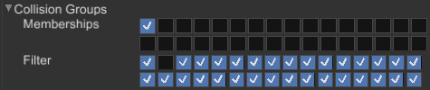
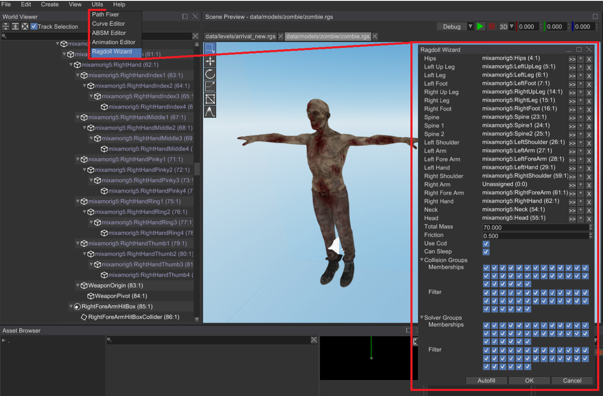

# Physics 

The engine have full-featured physics engine under the hood (Rapier), it helps you to simulate physics in your games.
There is first-class support for both 2D and 3D physics. There are three main physics entities in the engine:

- Rigid Body - responsible for rigid body dynamics simulation, must have at least one collider to be able to interact with other rigid bodies in the world.
- Collider - responsible for collision detection.
- Joint - responsible for motion restriction between two rigid bodies.

All these entities are ordinary scene nodes, so they can be arranged into any hierarchy in the scene. However there some rules that have to be followed to make physics simulation work as intended:

- Rigid body node must have at least one _direct child_ Collider node, otherwise rigid body won't interact with other rigid bodies in the world.
- Joint node must have two _direct child_ rigid bodies, otherwise joint will have no effect.

### Differences between 3D and 2D

There is a very few differences between 3D and 2D physics, the most obvious is that 2D physics does simulation only in oXY plane (the plane of the screen). 2D physics has less collider shapes available since some 3D shapes degenerate in 2D, for example cylinder 3D shape in 2D is just a rectangle. There is also lesser amount of joints available in 2D, there is no revolute joint for example. Unlike 3D physics entities, 2D physics entities exist in the separate `scene::dim2` module.

## Rigid body node

Rigid body node is the one of main physical entities in the engine. Rigid body nodes can be affected by gravity, external forces and other rigid bodies. Use rigid body node everywhere you need natural physical behavior for your objects.

### How to create

Use RigidBodyBuilder to create a rigid body instance:

```rust,no_run
{{#include ../code/snippets/src/scene/rigid_body.rs:create_cube_rigid_body}}
```

### Colliders

Rigid body must have at least one collider to participate in simulation properly, multiple colliders can be used to create complex shapes from simple shapes, you can create concave objects this way. Every collider **must** be a direct child node of a rigid body. In the editor it could look like this:


Note that, `Box` node here is an instance of `Rigid Body 2D`, and it has `Collider 2D` as a child and some sprite. This structure (when a rigid body has a collider as a child) is mandatory for physics engine to work correctly! Collider won't work (participate in physical simulation) without a rigid body and a rigid body won't work without a collider. This applied to both 2D and 3D.

Keep in mind, that your graphical representation of an object (some node like `Mesh`, `Sprite`, etc.) must be attached to a rigid body. Otherwise, the rigid body will move, but the graphical representation won't. You can also arrange it other way around: a graphical node can have rigid body with a collider, but that requires the rigid body to be kinematic. This is used to create [hit boxes](./collider.md#using-colliders-for-hit-boxes), or any other things that should have physical representation, but move together with graphical node.

### Force and torque

You can apply forces and torque to any rigid body, but only dynamic bodies will be affected. There is two ways of applying force to a rigid body: at center of mass or at particular point at the body:

```rust,no_run
{{#include ../code/snippets/src/scene/rigid_body.rs:apply_force_and_torque}}
```

### Kinematic rigid bodies

Sometimes you may want to have direct control over position/rotation of a rigid body and tell the physics engine to not do simulation for the body. This can be achieved by making the rigid body _kinematic_:

```rust,no_run
{{#include ../code/snippets/src/scene/rigid_body.rs:create_kinematic_rigid_body}}
```

### Continuous collision detection

Fast-moving rigid bodies can "fly through" other objects (for example a bullet can completely ignore walls if it is moving too fast), this happens because of discrete calculation. This can be fixed by using continuous collision detection, to enable it use either `.with_ccd_enabled(state)` of `RigidBodyBuilder` or `.set_ccd_enabled(state)` of `RigidBody`.

### Dominance

Dominance allows you to set a priority of forces applied to rigid bodies. It defines which rigid body can affect what rigid body, for example you can set the highest dominance for actors and leave dominance of everything else at zero, this way actors will be able to push any other dynamic bodies, but dynamic bodies won't affect actors. This is useful when you don't want your actors be pushed by surrounding objects (like if someone throws a box at an actor, it will stay still if it has higher dominance)

### 2D rigid bodies

2D rigid bodies have no difference with 3D, except the simulation happens in oXY plane and Z coordinate is ignored.

## Collider node

Collider is a geometrical shape that is used for collision detection, contact manifold generation, etc. Colliders are used in pair with rigid bodies, they make rigid body participate in collisions.

**Important:** Colliders only works in pair with rigid bodies! Colliders won't be used by the engine, unless they are direct children of a rigid body. Read [this chapter](./rigid_body.md#colliders) for more info. 

### Shapes

Collider can have almost any shape, the engine offers the following shapes for 3D:

- Ball - dynamic sphere shape.
- Cylinder - dynamic cylinder shape.
- Cone - dynamic cone shape.
- Cuboid - dynamic box shape.
- Capsule - dynamic capsule shape.
- Segment - dynamic segment ("line") shape
- Triangle - simple dynamic triangle shape
- Triangle mesh - static concave shape, can be used together with any static level geometry (wall, floors, ceilings,
anything else)
- Height field - static height field shape, can be used together with terrains.
- Polyhedron - dynamic concave shape.

Also, there is a similar, but smaller set for 2D (because some shapes degenerate in 2D):

- Ball - dynamic circle shape.
- Cuboid - dynamic rectangle shape.
- Capsule - dynamic capsule shape.
- Segment - dynamic segment ("line") shape.
- Triangle - dynamic triangle shape.
- Trimesh - static triangle mesh shape.
- Heightfield - static height field shape.

_Dynamic_ in both lists means that such shapes can be used together with _dynamic_ rigid bodies, they'll correctly handle
all collisions and simulation will look as it should. _Static_ means that such shape should be used only with _static_ rigid bodies.

### How to create

Use ColliderBuilder to create an instance of collider from code with any shape you want.

```rust,no_run
{{#include ../code/snippets/src/scene/collider.rs:create_capsule_collider}}
```

In the editor you can use `MainMenu -> Create -> Physics -> Collider`, or right-click on a node in `World Viewer` and select `Add Child -> Physics -> Collider`. Collider must be direct child of a rigid body, colliders do nothing on their own!

### Collision filtering

Sometimes there's a need to prevent collision between various groups of colliders. Fyrox supports bit-wise collision filtering exactly for this purpose. For instance, you may have two groups of colliders: actors and powerups, and you want the actors to completely ignore collisions with powerups (and vice versa). In this case you can set collision groups for actors like so:



And set the collision groups for powerups like so:


As you can see, actors and powerups now have separate `memberships` (read - groups) and filters. This way, the actors will collide with everything, but powerups and vice versa.

### Using colliders for hit boxes

You can use colliders to simulate hit boxes for your game characters. It can be done by creating a rigid body with `KinematicPositionBased` type and an appropriate collider as a child node. As the last step you need to attach the body to a bone in your character's model. Here's a quick example from the editor:


As you can see, the rigid body has a capsule collider as a child and the body is attached to the neck bone. The body has `KinematicPositionBased` type, which will ensure that the body won't be simulated, instead its position will be synchronized with the position of the parent bone.

To actually use the hit boxes in your game, you can either use a ray-casting to perform a hit scan or you can use contacts information to fetch the stuff with which a hit box was contacted. See [Ray casting](./ray.md) chapter of the section.

## Joint

Joint is a configurable link between two rigid bodies, it restricts relative motion of two bodies. Fyrox provides a fixed set of joints that are suitable for various applications.

- Fixed Joint - hard link between two bodies, it is the same is if two rigid bodies were "welded" to each other with a metal rod.
- Revolute Joint - restricts all translational movement and any rotations around Y and Z axes, but leaves rotation around local X axis free. An example of the joint from real world is a door hinge, it allows the door to rotate around single axis, but not move.
- Prismatic Joint - restricts all rotations, movement is allowed along single axis (local X of the joint). An example of the joint from real world could be a slider that supports drawers on a table.
- Ball Joint - restricts all movement, but leaves rotations unrestricted. An example of a ball joint from real world could be human shoulder.

2D joints does not have revolute joints, because it degenerates into ball joint.

### Bodies Binding

When the joint is created and all bodies are set to it, it uses self global transform and bodies global transforms to calculate local frames for bodies. This process is called _binding_, it happens once when the joint is created, but can be initiated by moving the joint to some other position by changing local transform of the joint.

### How to create

To create a joint from code use `JointBuilder`:

```rust,no_run
{{#include ../code/snippets/src/scene/joint.rs:create_joint}}
```

Once the joint is created, it will bind given bodies, using the process describe in the above section.

To create a joint from editor, use  `MainMenu -> Create -> Physics -> Joint`, select the new joint and find `Body1` and `Body2` properties. Assign the fields by holding `Alt` key and drag'n'drop a rigid body to a field. Move the joint to correct position to ensure the binding will happen as intended.

### Limits 

You can restrict motion on primary joint axis (rotational and translational) by setting a limit to desired axis. 

- Ball Joint have three angular limits, one per rotation around an axis. The angle range is given in radians.
- Prismatic Joint have only one limit it is maximum linear distance between two bodies along primary joint axis.
- Revolute Joint have a single angular limit around primary axis. The angle range is given in radians.
- Fixed Joint does not have any limit setting, because it locks all degrees of freedom.

### Usage

Joints can be used to create many game entities, such as doors, chains and rag dolls. The most interesting here is rag doll. It is used to create realistic behaviour for humans and creatures in games. In general, it is a set of rigid bodies, colliders and joints. Where each joint configured to match joints of a creature, for example ball joint could be used for shoulders, revolute joints for knees and elbows.

## Ray Casting

Ray casting allows you to query intersections of a ray with rigid bodies in a scene. Typical usage for ray casting is hit-scan weapons (weapons that shoots high-speed projectiles), AI collision avoidance, etc. To query intersections, use physics world instance of a scene graph:

```rust,no_run
{{#include ../code/snippets/src/scene/ray.rs:do_ray_cast}}
```

The function above will return a collection of intersections that are sorted by intersection distance (a distance from beginning of the ray to an intersection point). Each intersection is represented by the following structure:

```rust,no_run
pub struct Intersection {
    pub collider: Handle<Node>,
    pub normal: Vector3<f32>,
    pub position: Point3<f32>,
    pub feature: FeatureId,
    pub toi: f32,
}
```

- `collider` - a handle of the collider with which intersection was detected. To obtain a handle to rigid body, borrow the `collider` and fetch its `parent` field: `graph[collider].parent()`.
- `normal` - a normal at the intersection position in world coordinates.
- `position` - a position of the intersection in world coordinates.
- `feature` - additional data that contains a kind of the feature with which intersection was detected as well as its index. FeatureId::Face might have index that is greater than amount of triangles in a triangle mesh, this means that intersection was detected from "back" side of a face. To "fix" that index, simply subtract amount of triangles of a triangle mesh from the value.
- `toi` - (`time of impact`) a distance from ray's origin to `position`.

### Avoiding unnecessary allocations

As you might've noticed, the function above return `Vec<Intersection>` which allocates intersections on heap. This is relatively slow and could be sped up a lot by using static array on stack:

```rust,no_run
{{#include ../code/snippets/src/scene/ray.rs:do_static_ray_cast}}
```

`usage_example` shows how to use the `do_static_ray_cast` function - all you need to do is to specify maximum amount of intersections you're interested in as a generic parameter.

## Ragdoll

Ragdoll physics is a sort of procedural animation, that allows you to create naturally looking death animations and body physics in general. Ragdoll is just an arbitrary combination of rigid bodies, colliders, joints. Rigid bodies and colliders define physical "boundaries" for limbs of your character, while joints restrict relative motion (linear and rotational).

### How To Create

Creating a ragdoll manually is a very tedious procedure, you need to create rigid bodies and colliders for every body part of your character, place them correctly, adjust their size, etc. Then you need to create a set of joints, that connects body parts, and then setup linear and angular limits. To save time, Fyrox has a special tool called `Ragdoll Wizard`:



It can be opened from `Utils` menu and contains quite a lot of node handle fields that needs to be filled. Thankfully, there's an `Autofill` button, by pressing which, the wizard will try to find respective bones of the skeleton and put their handles in the respective fields in the wizard. For now, it is configured to work with [mixamo](https://www.mixamo.com) skeletons.

Other parameters are listed below:

- `Total Mass` - total mass of the ragdoll, it will be used to configure masses of rigid bodies of body parts. 
- `Use CCD` - a flag, that defines whether the continuous collision detection (CCD) for body parts should be used or not.
It is advised to keep this flag on, otherwise body parts might get stuck or fall through the floor, leading to "explosive" ragdoll behaviour.
- `Can Sleep` - a flag, that defines whether the body parts can "sleep" or not. Sleep in this case means, that a body part can be excluded from physical simulation if it is not moving for some time.
- `Collision Groups` and `Solver Groups` could be used to configure [collision filtering](collider.md#collision-filtering).
It is very important in case if your character has a physical capsule, that is used to "standard" character physics. In this case body parts must ignore physical capsule (and vice versa), otherwise your ragdoll will "explode".

After everything is filled in, you can click `OK` button and if everything is correct, you should see a bunch of new scene nodes in the world viewer, located under a `Ragdoll` scene node:


As you can see, the amount of entities you'd have to create and configure manually is quite high. Keep in mind, that ragdoll wizard can't generate perfect ragdoll, because of lack of information. The generated ragdoll will most likely require some minor tweaks (mostly joint angular limits).

### Video Tutorials

There's one video tutorial about ragdoll wizard, it also shows the final results in game:

<iframe width="560" height="315" src="https://youtube.com/embed/TxSlqGhCxYc" title="YouTube video player" frameborder="0" allow="accelerometer; autoplay; clipboard-write; encrypted-media; gyroscope; picture-in-picture" allowfullscreen></iframe>
