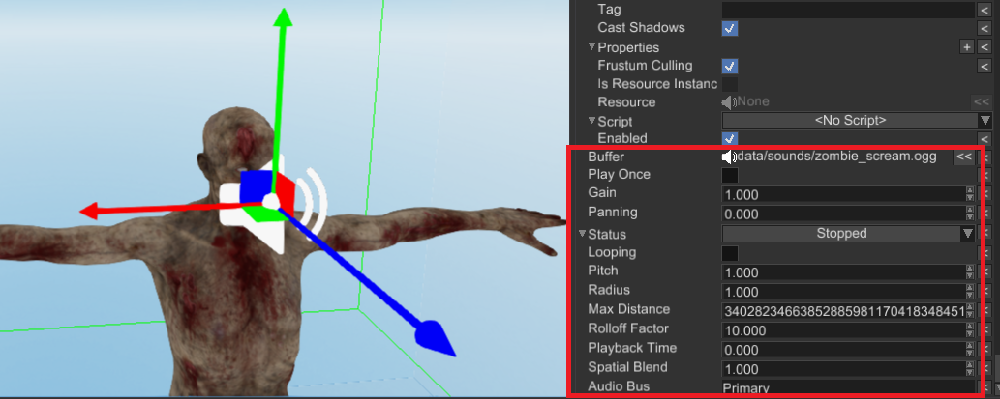

# Sound System

Fyrox has quite powerful and flexible audio system which will be covered in this chapter. Basic "building blocks" are sound sources, sound buffers, audio processing buses with various sound effects, sound context. Read the next chapters to learn more.

## Audio Bus

<iframe width="750" height="410" src="https://youtube.com/embed/6-M3LUv9Jto" title="YouTube video player" frameborder="0" allow="accelerometer; autoplay; clipboard-write; encrypted-media; gyroscope; picture-in-picture" allowfullscreen></iframe>

Audio bus is an audio processing unit that takes audio samples from any number of sound sources and passes them through a chain of effects (zero or more). Processed samples then can be either sent to an audio playback device (speakers, headphones, etc.) or to some other audio bus. There's always one audio bus (primary) that sends its data to an audio playback device, every other audio buses are considered secondary.

### Graph

As stated above, any audio bus (except primary), can output its audio samples to some other audio bus (primary or secondary). Such relationship forms an audio bus graph:


As you can see, there can be any number of sound sources which attached to the respective audio buses. Each audio bus can have any number of effects (such as lowpass, highpass, etc. filtering; reverb effect and more). Finally, each audio bus is connected to some other audio bus.

Such complex audio processing structure allows you to create pretty much any sound environment. For example, you can create an audio bus with a reverb effect, that will represent a huge hangar with lots of echoes. Then you attach all sound sources located in this "hangar" to the audio bus and your sound sources will sound more naturally, according to environment. 

### Effects

Audio bus can have zero or more audio processing effects. The effects applied one after another (see the arrows on the picture above). You can set any of the following effects:

- **Attenuation** - changes "volume" of input sound samples.
- **Reverb** - adds echoes, early and late reflections. Could be used to simulate environment with high reflectivity (hangars, parking lots, etc.)
- **Low Pass Filter** - passes all frequencies below the specified cut-off frequency.
- **High Pass Filter** - passes all frequencies above the specified cut-off frequency.
- **Band Pass Filter** - passes all frequencies in a given range around the specified cut-off frequency.
- **All Pass Filter** - shifts phase of the signal by 90 degrees at the specified cut-off frequency. 
- **Low Shelf Filter** - reduces amplitude of frequencies in a shape like this ̅ \_ at the cutoff frequency.
- **High Shelf Filter** - reduces amplitude of frequencies in a shape like this _/̅  at the cutoff frequency.

### Editor

In the editor, audio bus graph is located in the Audio Context panel:


Primary audio bus is located at the left of the panel, every other audio bus is located to the right. Each audio bus (except primary) has a dropdown list (at the bottom), that specifies output audio bus. The list of effect is located in the center; it can be edited in the Inspector (right side of the image).

To attach a sound source to an audio bus, select in the scene and find `Audio Bus` property in the Inspector and set it to the name of desired audio bus.

## Sound

In Fyrox, sounds are nodes of type `Sound`, with all the consequent properties and workflows.

### How to create

There are two major ways to create sound sources: from the editor and from code.

#### From Editor

A sound source could be created from `Create` menu (or from the same menu by right-clicking on a node in the world viewer):


After the source is created, you can select it and start editing its properties:



- `Buffer` - a sound buffer resource, that will be used as a source of samples. If it is empty, then no sound will be
played. Drag'n'drop a sound resource from the Asset Browser here to assign it to the source. 
- `Play Once` - a flag, that defines whether the engine should automatically delete the sound source node from the scene when it is finished playing. Could be useful for one-shot sounds.
- `Gain` - a numeric value in `[0..1]` range, that defines total volume of the sound source. Keep in mind, that this value sets the volume in _linear_ scale, while physically-correct approach would be to use logarithmic scale. This will be fixed in future versions.
- `Panning` - a numeric value in `[-1..1]` range, that defines how loud audio channels will be. `-1` - all the sound will be routed to the left channel, `1` - to the right channel. This option works only with 2D sounds (whose spatial blend factor is `0.0`)
- `Status` - a switch with three possible states: `Stopped`, `Playing`, `Paused`. By default, every sound source is in stopped state, do not forget to switch it to the `Playing` state, otherwise you won't hear anything.
- `Looping` - a flag, that defines whether the sound source should be playing infinitely, or not. Looping sound source will never switch their status to `Stopped`.
- `Pitch` - playback speed multiplier. By default, it is `1.0` which means default speed.  
- `Max Distance` - maximum distance, at which the sound source is affected by distance attenuation (for 3D sounds). By default, it set to max possible value. Lower values could be used to prevent sound source from be silent at certain distance.
- `Rolloff Factor` - a numeric value, that defines how fast the volume of the sound source will decay with increasing distance to a listener.
- `Playback Time` - desired time from which the playback should start (in seconds).
- `Spatial Blend` - a numeric value, that defines blending factor between 2D and 3D sound, where `0.0` - the sound is fully 2D, `1.0` - the sound is fully 3D. By default, the value is `1.0`.
- `Audio Bus` - a name of an audio bus, that will be used to process the samples from the sound source. By default, it is set to `Primary`. It should match the name of some audio bus, that will be used in your scene. More info about audio processing could found [here](bus.md).

#### From Code

Audio files are loaded using the resource manager:

```rust,no_run
{{#include ../code/snippets/src/scene/sound.rs:load_sound}}
```

Then, the node is built using the standard builder pattern:

```rust,no_run
{{#include ../code/snippets/src/scene/sound.rs:build_sound_node}}
```

There are a few notable things in the example above.

The first is that sounds don't play automatically; in order to do so, we need to invoke `.with_status(Status::Playing)`.

The second is that sound nodes are not dropped automatically after playback; dropping it can be performed in two ways. One way is to use the convenient builder API `.with_play_once(true)`; another is to use the graph APIs:

```rust,no_run
{{#include ../code/snippets/src/scene/sound.rs:sound_removal}}
```

If we want to play background music (or anyway a repeated sound), we just set the `looping` property when building the node:

```rust,no_run
{{#include ../code/snippets/src/scene/sound.rs:looping}}
```

In order to stream large audio files, instead of loading them entirely in memory, the simplest strategy is to create a corresponding `.options` file, with the following content:

```json
(
  stream: true
)
```

If the audio file is called, for example, `/path/to/background.ogg`, call this `/path/to/background.ogg.options`.

### 2D and 3D 

There's no strict separation between 2D and 3D sound sources. The same source could be switched from 2D to 3D (and vice versa) at runtime, by just adjusting `Spatial Blend` property. Spatial blend factor is a numeric value, that defines blending factor between 2D and 3D sound, where `0.0` - the sound is fully 2D, `1.0` - the sound is fully 3D. By default, the value is `1.0` which makes it 3D. Intermediate values could be used to create "ambisonic" sound sources - when the source sounds like it is placed at some position in the world, but some part of it is just 2D and does not depend on positioning.

### Audio bus

It is possible to specify target audio bus to which the sound will output its audio samples. Audio bus is responsible for various audio processing, such as filtering, reverb, etc. To specify output audio bus, just use the `set_audio_bus` method and set the name of an audio bus.

## Head Related Transfer Function 

Head Related Transfer Function (HRTF for short) is special audio processing technique that improves audio spatialization. By default, sound spatialization is very simple - volume of each audio channel (left and right) changes accordingly to orientation of the listener. While this simple and fast, it does not provide good audio spatialization - sometimes it is hard to tell from which direction the actual sound is coming from. To solve this issue, we can use head-related transfer function. Despite its scary, mathematical name, it is easy to understand what it's doing. Instead of uniformly changing volume of all frequencies of the signal (as the naive spatialization does), it changes them separately for each channel. The exact "gains" of each frequency of each channel is depends on the contents of head-related transfer function. This is done for each azimuth and elevation angles, which gives full picture of how audio signal from each direction travels to each ear.

HRTF is usually recorded using a head model with ears with a microphone inside each ear. To capture head-related impulse response (time domain) at a fixed distance and angle pair (azimuth and elevation), a very short impulse of sound is produced. Microphones inside each ear records the signal, and then HRIR (time domain) can be converted in HRTF (frequency domain).

### HRTF on practice

The theory above could be boring, however it is very simple to use HRTF on practice. Pick a HRIR sphere from the [database](https://github.com/mrDIMAS/hrir_sphere_builder/tree/master/hrtf_base/IRCAM) (any of *.bin files) and load it in the Audio Context panel:


Once it is loaded, all sounds in the scene will use the HRTF for rendering. The same can be achieved by code:

```rust,no_run
# extern crate fyrox;
# use fyrox::scene::{
#     graph::Graph,
#     sound::{self, HrirSphere, HrirSphereResource, HrirSphereResourceExt, HrtfRenderer, Renderer},
# };
# 
fn use_hrtf(graph: &mut Graph) {
    let hrir_sphere = HrirSphereResource::from_hrir_sphere(
        HrirSphere::from_file("path/to/hrir.bin", sound::SAMPLE_RATE).unwrap(), "path/to/hrir.bin".into());
    graph
        .sound_context
        .state()
        .set_renderer(Renderer::HrtfRenderer(HrtfRenderer::new(hrir_sphere)));
}
```

### Performance

HRTF is heavy. It is 5-6 times slower than the simple spatialization, so use it only on middle-end or high-end hardware. HRTF performance is linearly dependent on the amount of sound sources: the more sound sources use HRTF, the worse performance will be and vice versa.