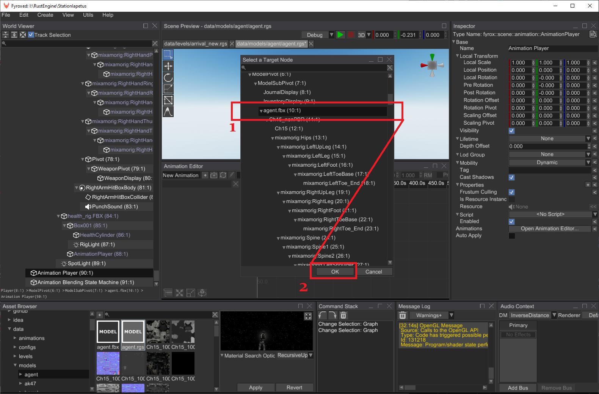
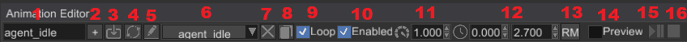
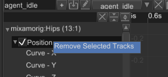
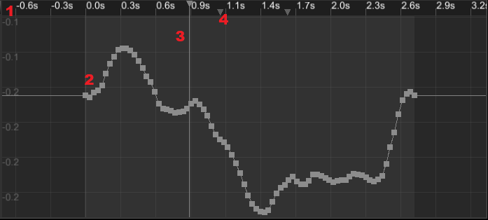
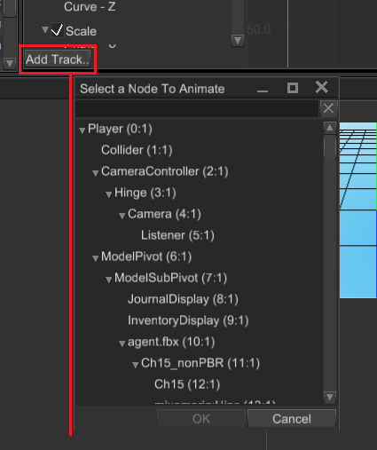
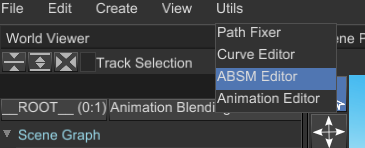
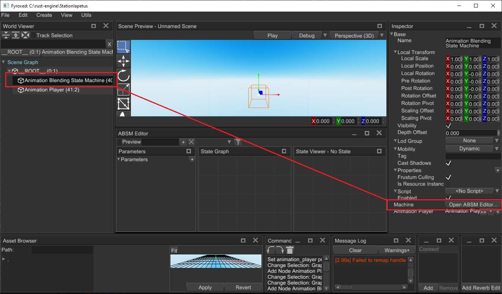
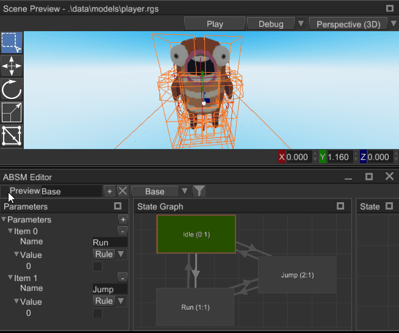
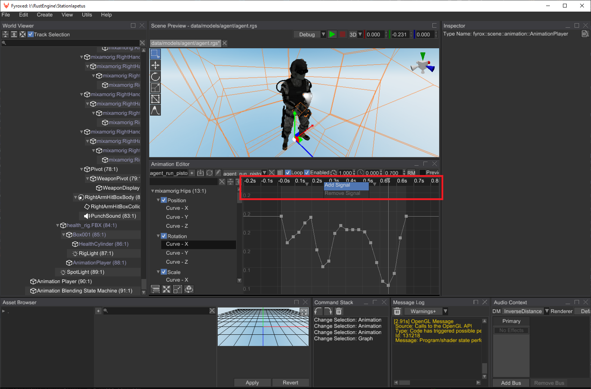
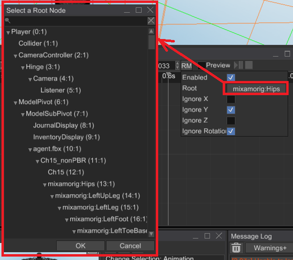

# Animation

Animation allows you to change properties of scene nodes at runtime using a set of key frames. Animation consists of multiple tracks, where each track is bound to a property of a scene node. A track can animate any numeric properties, starting from numbers (including `bool`) end ending by 2/3/4 dimensional vectors. Each component (number, x/y/z/w vector components) is stored in a _parametric curve_. Every parametric curve contains zero or more _key frames_. Graphically this could be represented like so:

```text
                                         Timeline
                                            v
  Time   > |---------------|------------------------------------>
           |               |
  Track1 > | node.position |                                     
           |   X curve     |..1..........5...........10..........
           |   Y curve     |..2.........-2..................1....  < Curve key frames
           |   Z curve     |..1..........9......................4
           |_______________|  
  Track2   | node.property |                                  
           | ............  |.....................................
           | ............  |.....................................
           | ............  |.....................................
```

Each key frame is just a real number with interpolation mode. Interpolation mode tells the engine how to calculate intermediate values between key frames. There are three kinds of interpolation used in animations (you can skip "boring math" if you want):

- **Constant** - intermediate value will be calculated using leftmost value of two. Constant "interpolation" is usually used to create step-like behaviour, the most common case is to "interpolate" two boolean values.
- **Linear** - intermediate value will be calculated using linear interpolation `i = left + (right - left) / t`, where `t = (time_position - left) / (right - left)`. `t` is always in `0..1` range. Linear interpolation is usually used to create "straight" transitions between two values.
- **Cubic** - intermediate value will be calculated using Hermite cubic spline: `i = (2t^3 - 3t^2 + 1) * left + (t^3 - 2t^2 + t) * left_tangent + (-2t^3 + 3t^2) * right + (t^3 - t^2) * right_tangent`, where `t = (time_position - left) / (right - left)` (`t` is always in `0..1` range), `left_tangent` and `right_tangent` is usually a `tan(angle)`. Cubic interpolation is usually used to create "smooth" transitions between two values.

### Web Demo

You can explore animation system capabilities in this [web demo](https://fyrox.rs/assets/demo/animation/index.html). Keep in mind, that it was designed to run on PC and wasn't tested on mobile devices.

### Track binding

Each track is always bound to a property in a node, either by its name or by a special binding. The name is used to fetch the property using reflection, the special binding is a faster way of fetching built-in properties. It is usually used to animate position, scale and rotation (these are the most common properties available in every scene node).

### Time slice and looping
While key frames on the curves can be located at arbitrary position in time, animations usually plays a specific time slice. By default, each animation will play on a given time slice infinitely - it is called _animation looping_, it works in both playback directions.

### Speed
You can vary playback speed in wide range, by default every animation has playback speed multiplier set to 1.0. The multiplier tells how faster (>1) or slower (<1) the animation needs to be played. Negative speed multiplier values will reverse playback.

### Enabling or disabling animations
Sometimes there's a need to disable/enable an animation or check if it is enabled or not, you can do this by using the pair of respective methods - `Animation::set_enabled` and `Animation::is_enabled`.

### Signals
Signal is a named marker on specific time position on the animation timeline. Signal will emit an event if the animation playback time passes signal's position from left-to-right (or vice versa depending on playback direction). Signals are usually used to attach some specific actions to a position in time. For example, you can have a walking animation and you want to emit sounds when character's feet touch ground. In this case you need to add a few signals at times when each foot touches the ground. After that all you need to do is to fetch animation events one-by-one and emit respective sounds. See respective  [chapter](signal.md) for more info.

### Creating From Code

Usually, animations are created from the editor or some external tool and then imported in the engine. Before trying the example below, please read the docs for `AnimationPlayer` node, it is much more convenient way of animating other nodes. The node can be created from the editor, and you don't even need to write any code. Use the following example code as a guide **only** if you need to create procedural animations:

```rust,no_run
{{#include ../code/snippets/src/animation/mod.rs:create_animation}}
```

The code above creates a simple animation that moves a node along X axis in various ways. The usage of the animation is only for the sake of completeness of the example. In the real games you need to add the animation to an animation player scene node, and it will do the job for you.

### Importing

It is also possible to import an animation from external source (such as FBX files). You can do this in two major ways: from code or from the editor. The following sections shows how to use both ways.

#### From Editor

At first, make sure that you have your 3D model instantiated in the scene. The following example has `agent.fbx` instance in the scene (to do that, just drag'n'drop your 3D model in the scene from the Asset Browser). To import an animation you need to create an `Animation Player` scene node, open the [Animation Editor](anim_editor.md) and click the button with arrow-down icon:


Now you need to pick the root node of your 3D model to which you'll import your animation. Usually it will be called the same as your 3D model (`agent.fbx` on the screenshot below):



The last thing you need to do is to pick the animation you want to import:


If everything is correct, you can preview your animation by clicking `Preview` checkbox:


#### From Code

You can do the same as in the previous section, but from code:

```rust,no_run
{{#include ../code/snippets/src/animation/mod.rs:create_animated_character}}
```

As you can see, at first this code creates an instance of a 3D model. Then it loads an animation and creates its instance in the animation player. Please note, that this code uses `async`, which produces a future which should be driven by some executor. You can use `block_on` method to execute it at call site (this won't work on WebAssembly).

It is advised to prefer the editor to code approach, because it hides all this tedious code and properly handles asynchronous loading on all platforms.

### Playing an Animation

Animations will be played automatically if the respective animation player is has the property `Auto Apply` set to `true`. Since the animation player can contain multiple animations, all of them will be played at once. You can enable/disable animations when needed by finding them by name from code and switching `Enabled` property:

```rust,no_run
{{#include ../code/snippets/src/animation/mod.rs:enable_animation}}
```

This code could also be used to change animation properties at runtime. To do that, replace `set_enabled` with some other methods, such as `set_speed`, `set_loop`, `set_root_motion_settings` etc.

## Animation Editor


Animation Editor is a tool that helps you to create and preview animations. This is a powerful tool that can be used to animate pretty much any numeric property. It has three main parts:

1. `Toolbar` - contains a set of tools that changes a particular part of an animation (name, length, speed, etc.)
2. `Track List` - contains a list of tracks of nodes that will be animated.
3. `Curve Editor` - curve editor allows you to edit behaviour of a numeric parameter over the time. 

The editor can be opened in two ways - using `Utils -> Animation Editor` or by selecting an animation player node and clicking `Open Animation Editor` button in the inspector.


In both ways you still need to select an animation player for editing.

### Typical Workflow

At first, you need to create or [import](#animation-importing) an animation, then you need to set its time slice to desired range (see [Time Slice](#toolbar) in the section below), then you need to add a few tracks for desired properties and finally add some keys. You can [preview](#preview-mode) the results at any time, keep in mind that any attempt to change an animation while it is the preview mode, will revert every change from the preview mode and only then apply your change.

### Toolbar

The toolbar contains a set of tools that changes a particular part of an animation (name, length, speed, etc.). It looks like this:



1. `Animation Name` - name of a currently selected animation.
2. `Add Animation` - adds a new empty animation with the name from the text box at the left to the animation player. 
3. `Import Animation` - starts animation importing process. See [Animation Importing](#animation-importing) section for more info.
4. `Reimport Animation` - re-imports the animation from an external file, it is useful if you need to change animation's content, while keep references to it valid.
5. `Rename Animation` - renames a currently selected animation using the name from the text box at the left.
6. `Animation Selector` - allows you to switch currently edited animation.
7. `Delete Animation` - deletes a currently selected animation, tries to select last animation from the list if possible.
8. `Duplicate Animation` - clones a currently selected animation.
9. `Loop Animation` - enables or disables looping of a currently selected animation.
10. `Enable Animation` - enables or disables a currently selected animation.
11. `Animation Speed` - sets a new playback speed of a currently selected animation.
12. `Time Slice` - a time range (in seconds) which defines start and end time of a currently selected animation. The range is highlighted in the curve editor.
13. `Root Motion` - open root motion settings. See [Root Motion](#root-motion) section for more info.
14. `Preview Switch` - enables or disables animation preview. See [`Preview Mode`](#preview-mode) section for more info.
15. `Play/Pause` - plays or pauses a currently selected animation (allowed only in the preview mode).
16. `Stop` - stops a currently selected animation (allowed only in the preview mode).

### Track List

The track list contains a list of tracks of nodes that will be animated. It looks like this:


1. `Filter Bar` - filters the track list by finding tracks whose names matching the filter. You can use this to find tracks that belong to a particular scene node.
2. `Clear Filter` - clears the filter, the track list will show all the tracks after this.
3. `Collapse All` - collapses all the tracks in the list.
4. `Expand All` - expands all the tracks in the list.
5. `Track` - a track with some number of children parametric curves.
6. `Track Component Curve` - parametric curve that serves a data source for the animation for a particular track.
7. `Track Switch` - enables or disables a track; disabled tracks won't "touch" their properties.
8. `Add Track` - starts property binding process, see [Property Binding](#property-binding) section for more info.

#### Track Context Menu



- `Remove Selected Tracks` - removes selected tracks; you can remove multiple tracks at a time by selecting them while holding `Ctrl`.

### Curve Editor

Curve editor allows you to edit parametric curves (one at a time). A curve consists of zero or more key frames with various transition rules between current and the next. The editor looks like this:



1. `Time Ruler` - shows time values and every signal of a currently selected animation. A click on the time ruler will move the playback cursor at the click position. You can move it by clicking at the cursor and moving the mouse while holding the left mouse button. Animation signals can be moved in the same fashion.
2. `Parametric Curve` - a curve that defines how a value changes over time.
3. `Time Thumb` - animation playback cursor, useful only for preview.
4. `Animation Signal` - some animation signal that will produce animation events when the playback cursor passes it. 

#### Time Ruler Context Menu


- `Remove Signal` - removes an animation signal under the mouse cursor.
- `Add Signal` - adds a new animation signal at the mouse cursor position.

#### Key Frame Context Menu


- `Location` - shows a key location and allows you to change it. Useful for setting precise values. 
- `Value` - shows a key value and allows you to change it. Useful for setting precise values.
- `Add Key` - adds a new key to the curve.
- `Remove` - removes all selected keys. You can select multiple keys either by box selection (click and drag the mouse to active box selection) or by clicking on separate keys while holding `Ctrl`.
- `Key...` - allows you to change the interpolation type of key. It could be one of the following values: Constant, Linear, Cubic.
- `Zoom To Fit` - tries to find zooming values (for both axes) and the view position with which the entire curve fits in the viewport.

### Property Binding

To animate a property all you need to do is to click on `Add Track...` button at the bottom of the track list, select a node to animate and then select a property that will be animated. There are two windows that will be shown one after another:




You can cancel property binding at any time by clicking `Cancel` in any of the windows. Keep in mind that you can animate only numeric properties, so not every property is shown in the window.

### Animation Importing

Animations can be stored in separate files, but the engine requires all of them to be in a single Animation Player. To put an animation from an external resource (an FBX, for instance) in the animation player you can use animation importing. To do that, click on animation import icon and then select a root node of the hierarchy that is animated in the external animation file, then select the animation file and click `Ok`. The engine will try to import the animation and map it to the given hierarchy, mapping is done using node names, so animated node names must match in both your scene and your external animation file. 


Content of existing animations can be replaced by reimporting. Click on a button with two circular arrows to reimport your animation. It could be useful if you changed your animation in some external editor (Blender for example) and want to apply changes in your game.

### Preview Mode

Preview mode helps you to see and debug your animation. After activating the mode, you need to play the animation by clicking the `Play/Pause` button:


Any significant change made in the scene will automatically deactivate the preview mode reverting all the changes made by playing animation.

### Root Motion

See [Root Motion chapter](root_motion/root_motion.md) for more info.

### Limitations

For now there's no dopesheet mode in the editor, you can edit only one numeric parameter at a time. Also, there's no capture mode - this is a special mode in which the editor automatically adds your changes in the scene to the animation. These limitations will be removed in the future versions.

## Animation Blending

Animation blending is a powerful feature that allows you to mix multiple animations into one. Each animation is mixed with a various weights which in sum gives 1.0 (100%). By having opposite coefficients (k1 = 0 -> 1, k2 = 1 -> 0) changing in time it is possible to create transition effect. 

Handling transitions with all the coefficients is a routine job, the engine can handle it for you giving you some nice
features:

- Multiple states with smooth transitions between them
- Ability to blend multiple animations in one and use it as pose source for blending
- Ability to specify a set of variables that will be used as blending coefficients and transition rules.

All these features consolidated in so-called animation blending state machine (ABSM). Machine is used to blend multiple animation as well as perform automatic "smooth" transition between states. In general, ABSM could be represented like this:


At the first look it may seem very complicated, but in reality it uses quite simple techniques. Let's start from the left side of the picture and go to the right. Yellow rectangle at the left depicts an animation player node that contains a bunch of animations, that will be used for blending. Two center blocks (layer 0 and layer 1) depicts separate layers (ABSM could have any number of layers in it). Each layer can contain an arbitrary nodes (green shapes), states (blue shapes), transitions (thick yellow arrows). 

Nodes serves as a source of poses, that can be blended in any desired way. States are the part of the inner state machine, only one state could be active at the same time. Transitions are used to specify state transition rules. 

At the "exit" of each layer there's a layer filter, it is responsible for filtering out values for specific scene nodes and could be used to prevent some scene nodes from being animated by a certain layer. Please note that despite the look of it, layer filter not necessarily be applied after all animations and states are blended - it could be done at any moment and drawn like so only for simplicity reasons.

The last, but not the least, important thing on the picture is the parameters container on the right side of the picture. Parameter either a transition rule, blending weight, or sampling point. If you look closely at the transitions or animation blending nodes you'll see small text marks. This is the names of the respective parameters.

In general, any state machine works like this - ABSM nodes are used to blend or fetch animations and their resulting poses are used by ABSM states. Active state provides final pose, which is then passes filtering and returned to you. After the last stage, you can apply the pose to a scene graph to make the resulting animation to have effect.

### How to create

As always, there are two major ways of creating things in Fyrox - from the editor or from code. Take your pick.

### From editor

Use [ABSM Editor](absm_editor.md) for to create animation blending state machines. 

### From code

You can always create an ABSM from code, a simple ABSM could be created like this:

```rust,no_run
{{#include ../code/snippets/src/animation/blending.rs:create_absm}}
```

Here we have Walk, Idle and Run states which use different sources of poses:
- Walk - is the most complicated here - it uses result of blending between `Aim` and `Walk` animations with different weights. This is useful if your character can only walk or can walk *and* aim at the same time. Desired pose determined by Walk Weight and Aim Weight parameters combination.
- Run and idle both directly use animation as pose source.

There are four transitions between three states each with its own rule. Rule is just a boolean parameter that indicates that transition should be activated. Let's look at the code example of the above state graph:

As you can see, everything is quite straightforward. Even such simple state machine requires quite a lot of code, which can be removed by using ABSM editor. Read the next chapter to learn about it.

## Animation Blending State Machine (ABSM) Editor

While it is possible to create and manage animation blending and state manually from code, it quickly becomes too annoying and hardly manageable. To help you create and manage blending machines in easy way, the engine offers an ABSM Editor tool. This chapter is an overview of the editor, it is quite complex, but the guide should help you to figure out which part is made for what. Next chapter will help you to create your first animation blending state machine.


The editor has four main parts (panels):

1. `Toolbar` - contains a set of tools to edit animation layers and enable/disable preview mode. See [Toolbar](#toolbar) section for more info.
2. `Parameters` - allows you to edit various variables that are responsible for transitions, weight parameters for  blending, etc. See [Parameters](./absm_parameters.png) section for more info.
3. `State Graph` - allows you to create, delete, edit states and transition between them. See [State Graph](#state-graph) section for more info.
4. `State Viewer` - allows you to edit pose source for a state. Pose source can be represented either by a single  node that plays an animation, or a series of play animation nodes connected to blending nodes (which can be connected to other blending nodes, etc.). See [State Viewer](#state-viewer) section for more info.

The editor can be opened in two ways - using `Utils -> ABSM Editor` or by selecting an animation blending state machine node and clicking `Open ABSM Editor...` button:





In both ways you still need to select an an animation blending state machine node for editing.

### Toolbar


1. `Preview Switch` - enables or disables preview mode for the ABSM. See [Preview Mode](#preview-mode) section for more info.
2. `Layer Name` - name of the selected layer. Type a new name here to rename currently selected layer (hit enter or just click elsewhere to rename).
3. `Add Layer` - adds a new layer with the name in the `Layer Name` text box to the ABSM. ABSM can have multiple layers with the same name, but it strongly advised to set unique names here.
4. `Remove Current Layer` - removes currently selected layer. You can delete all layers, but in this case your ABSM won't have any effect.
5. `Layer Selector` - allows you to select a layer for editing, default selection is none.
6. `Layer Mask` - opens a `Layer Mask Editor` and helps you to edit the layer mask of the current layer. See 
[Layer Mask](#layer-mask) section for more info.

### Parameters

Parameter is a named and typed variable that provides the animation system with some data required for it to work. There are only three type of parameters:

- `Rule` - boolean value that used as a trigger for transitions. When transition is using some rule, it checks the value of the parameter and if it is `true` transition starts.
- `Weight` - real number (`f32`) that is used a weight when you're blending multiple animations into one.
- `Index` - natural number (`i32`) that is used as an animation selector.


1. `Add Parameters` - adds a new parameter to the parameters' container.
2. `Remove a Parameter` - removes selected parameter from the parameters' container.
3. `Parameter Name` - allows you to set a parameter name.
4. `Parameter Type` - allows you to select the type of the parameter.
5. `Parameter Value` - allows you to set parameter value.

### State Graph

State Graph allows you to create states and transitions between them. 


1. `State` - state is final animation for a set of scene nodes, only one state can be active at a time.
2. `Transition` - is an _ordered_ connection between two states, it defines how much time it needed to perform blending of two states.
3. `Root State` - is an entry state of the current layer.

#### State Context Menu


- `Create Transition` - starts transition creation from the current state to some other.
- `Remove` - removes the state.
- `Set As Entry State` - marks the state as an entry state (this state will be active at beginning).

#### Transition Context Menu


- `Remove Transition` - removes selected transition.

#### State Properties

Select a `State` node to edit the following properties:


- `Position` - is a location of the state on the canvas.
- `Name` - name of the state.
- `Root` - handle of the backing animation node inside the state.

#### Transition Properties

Select a `Transition` node to edit the following properties:


- `Name` - name of the state.
- `Transition Time` - amount of time for blending between two states (in seconds).
- `Elapsed Time` - starting amount of blending time.
- `Source` - handle of a source state.
- `Desc` - handle of a destination state.
- `Rule` - a name of `Rule` type parameter that defines whether the transition can be activated or not.
- `Invert Rule` - defines whether to invert the value of `Rule` or not.
- `Blend Factor` - defines a percentage (in `0..1` range) of how much transition was active. 

### State Viewer

State Viewer allows you to edit contents of states. You can create animation blending chains of any complexity, the simplest content of a state is just a single `Play Animation` node. Currently, the engine supports just three animation blending nodes:

- `Play Animation` - takes animation pose directly from specified animation, does nothing to it.
- `Blend Animations` - takes multiple animation poses from respective animations and blends them together with  respective blend weights.
- `Blend Animations By Index` - takes multiple animation poses from respective animations and switches between them with "smooth" transition using an index parameter.


1. `Node` - is a source of animation for blending.
2. `Connection` - defines how nodes are connected to each other. To create a new connection, click on a small dot on a node, hold the button and start dragging to a dot on some other node. 
3. `Root Node` - root node is marked green; root node is a final source of animation for the parent state. 

#### `Play Animation` Properties

Select a `Play Animation` node to edit the following properties:


- `Position` - is a location of the node on the canvas.
- `Animation` - an animation to fetch the pose from.

#### `Blend Animations` Properties

Select a `Blend Animations` node to edit the following properties:


- `Position` - is a location of the node on the canvas.
- `Pose Sources` - a set of input poses. To add a pose either click on `+` or `+Input` on the node itself. Don't forget to connect some nodes to the new input poses.
  - `Weight` - a weight of the pose; could be either a constant value or some parameter.

#### `Blend Animations By Index` Properties

Select a `Blend Animations By Index` node to edit the following properties:

 

- `Position` - is a location of the node on the canvas.
- `Index Parameter` - a name of an indexing parameter (must be `Index` type).
- `Inputs` - a set of input poses. To add a pose either click on `+` or `+Input` on the node itself. Don't forget to
connect some nodes to the new input poses.
  - `Blend Time` - defines how much time is needed to transition to the pose.

#### Connection Context Menu

Every connection has a context menu that can be shown by a right-click on a connection.


- `Remove Connection` - removes the connection between parent nodes.

#### Node Context Menu

Every node has a context menu that can be shown by a right-click on a connection.


- `Set As Root` - sets the node as the final pose source of the parent state. 
- `Remove` - removes the node from the state.

### Layer Mask


Layer mask editor allows you to select which nodes **won't** be animated by the current animation layer. Selected nodes are marked with dark color. To select multiple nodes at once, hold `Ctrl` and click on items. The text box at the top of the window allows you to search for a particular scene node. To save edited layer mask click `OK`.

### Preview Mode

Preview mode turns on the animation blending state machine and its animation player and allows you to see the result of the work of the machine. Any significant changes in the scene automatically disables the preview mode and any changes done by the machine is discarded. While the preview mode is active, you can freely change the values of the parameters to see how the machine will react to this. This helps you to debug your state machine, it is especially useful for complex state machines with lots of layers. Here's how the preview mode works:



## Signals

In some cases you may need to perform an action when at certain time of your animation. It could be a footstep sound, when foot touches ground, grenade tossing, etc. This could be done via animation signals. Animation signal is just a named marker that has time position at an animation timeline. It will be emitted when animation playback time passes it (left-to-right or right-to-left depending on the actual speed of your animation). All you need to do, is to catch these signals in your game code and do the desired actions.

### How to add

As usual, there are two possible ways of adding animation signals - from the animation editor and from code. 

#### From animation editor

To add a signal to some animation, select an animation player, open the animation editor, select some animation in it. Now all you need to do is to right-click on the timeline and press `Add Signal`.



After the signal is added, you can select it and edit its properties in the inspector. Also, you can drag it on the timeline to adjust its position.


Set a meaningful name to the signal, and it is pretty much done - all you need to do next is to write signal handling code in your game. See [the next section](#reacting-to-signal-events) to learn how to do it.

#### From code

A signal could also be added from code, this requires knowing a handle of your animation player and a name/handle of your animation. Please note the comment about signal's uuid in the code below.

```rust,no_run
{{#include ../code/snippets/src/animation/signal.rs:add_signal}}
```

### Reacting to signal events

When you have your signals ready for use, all you need to do is to react to the signals somehow. This is very simple: just borrow your animation from the animation player and pop animation event one-by-one from internal queue:

```rust,no_run
{{#include ../code/snippets/src/animation/signal.rs:react_to_signal_events}}
```

You can do pretty much anything when reacting to signals. For example, this could be a prefab instantiation to create smoke effect under the feet, playing a footstep sound, etc.

### Events from ABSM

Animation blending state machines are able to collect events from the currently playing animations using different strategies. This ability prevents you from tedious manual animation events collection from a bunch of animations manually. 

```rust,no_run
{{#include ../code/snippets/src/animation/signal.rs:collect_events_from_absm}}
```

This function collects all animation events from all active animations in the specified ABSM (in its first layer). The arguments to it are the following:

- `absm` - a handle to an animation blending state machine node.
- `strategy` - event collection strategy, which includes all events collection, max and min weight. The last two may be used if you're getting a lot of events and want to get events from the animations with max or min weights respectively.
- `ctx` - current script context, available in pretty much any script methods.

## Root Motion

Root motion is a special technique that transfers motion from some node in a hierarchy to a physical  capsule, which is then used to perform the actual motion. In action it looks like this:

<iframe width="750" height="410" src="https://youtube.com/embed/0lG8Spzk128" title="YouTube video player" frameborder="0" allow="accelerometer; autoplay; clipboard-write; encrypted-media; gyroscope; picture-in-picture" allowfullscreen></iframe>

As you can see in the first part of the video, the movement of the character looks more like floating above the ground. This happens because the actual movement of the physical capsule is not synchronized with the  movement of the character. Root motion fixes exactly this issue by taking the motion of some root node of the animated hierarchy (hips in case of this character) and transferring it to the physical capsule. This makes  the actual movement to be fully synchronized with the movement "baked" in the animation.

Root motion also have some nice effect - you can move your character solely by the movement from animation, and it will work perfectly in 99% of cases. Animations can also contain some rotations which can also be extracted and applied to the physical capsule. The next awesome property is that your character will never stand out of  its physical capsule, which will prevent phasing it into walls when playing animations with large movements.

In general, you should prefer root motion -driven movement for your characters whenever you can. Simply because it eliminates a lot of common problems with character movement. It can also be applied to 2D world and will  work exactly the same. 

### How to enable

You can enable/disable/setup it in the drop-down menu that opens by clicking `RM` button in the animation editor. Keep in mind, that root motion should be configured on _per animation_ basis. Most of the animations does not need the root motion at all.


The most important part here is the `Root` handle, it should be set to a root node that moves by your animation, usually it is called like "hips" or similar:



After that, you need to apply filters for axes - most of the locomotion animations "works" in oXZ plane, so Y axis should be ignored. Also, if you don't have any turns in your animation, you can also filter out the rotation part.

Alternatively, you can do the same from code:

```rust,no_run
{{#include ../../code/snippets/src/animation/root_motion.rs:setup_root_motion}}
```

This code does pretty much the same as the editor on the screenshots above. The arguments of this function are the following: 

- `animation_player` - a handle to the animation player in which all your animations are stored,
- `animation` - a handle of the animation in which you want to enable the root motion (you can obtain the handle by using [AnimationContainer::find_by_name_ref](https://docs.rs/fyrox/latest/fyrox/animation/struct.AnimationContainer.html#method.find_by_name_ref) method).
- `root_node` - a handle to a root node of your character's hierarchy, usually it is called something like "Hips" or "Pelvis".
- `ctx` - script context from your current script.

### How to use

Direct root motion values extracted from animations are kind of useless by their own and in 99% of the cases you should get the average root motion values from a [state machine](../blending.md) that animates your character. This is because animation blending state machine properly blends the root motion from all active animation sources. In general, it could look something like this:

```rust,no_run
{{#include ../../code/snippets/src/animation/root_motion.rs:fetch_and_apply_root_motion}}
```

This code extracts the current **local-space offset** for the current frame and then transforms the offset to world-space coordinates. Finally, it reduces the offset by the current delta time (`1.0 / ctx.dt`) to obtain the new velocity vector which is then applied to the rigid body (player's capsule).

The arguments in this function are following: 

- `absm` a handle to an instance of Animation Blending State Machine node
- `rigid_body` a handle to the rigid body that is used by your character
- `model` - a handle to the root node of your character's 3D model.

#### Raw root motion values

If for some reason you still need raw root motion values from animations, then you can extract them directly from the desired animation by using [Animation::root_motion](https://docs.rs/fyrox/latest/fyrox/animation/struct.Animation.html#method.root_motion) method.

### Combining root motion with procedural motion

Sometimes there's a need to combine root motion with some procedural motion (for example - inertia after jumping). This could be done pretty easily by adding two velocity vectors - one from the root motion, and one from the procedural motion.

## Sprite Animation

Sprites can be animated using a series of pre-made images. For performance reasons they're usually packed into a rectangular texture, where each individual image located in its own cell of a grid. Such texture is called a sprite sheet, and it looks something like this:


As you can see, there are multiple frames for each animation (idle, run, sword swing, etc.) packed into a single image. To play an animation, all we need to do is to change frames with some desired frequency and... that's pretty much all. That's the simplest animation technique one could imagine.

Sprite sheets usually made by artists, not programmers, so just search online for some sprite sheet or order a new one from an artist. Programmer's art is pretty much always bad.

### How to use


Fyrox offers a built-in sprite animation system which has its own editor. To be able to use sprite animation all you need to do is to add a `SpriteSheetAnimation` field (or a bunch of them) to your script and put the following code in its `on_update`:

```rust
{{#include ../../code/snippets/src/animation/mod.rs:animation}}
```